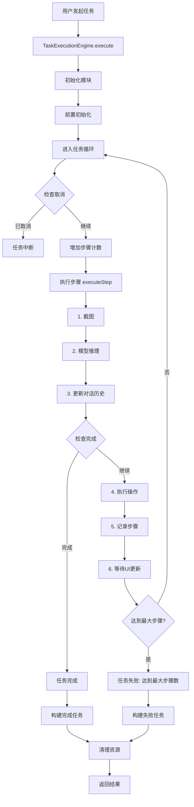
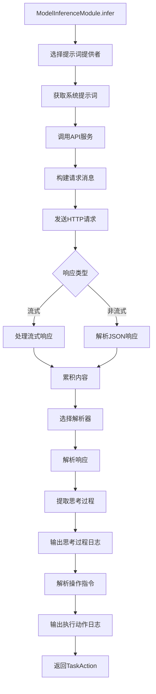
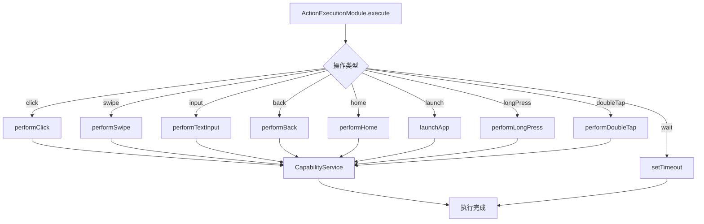
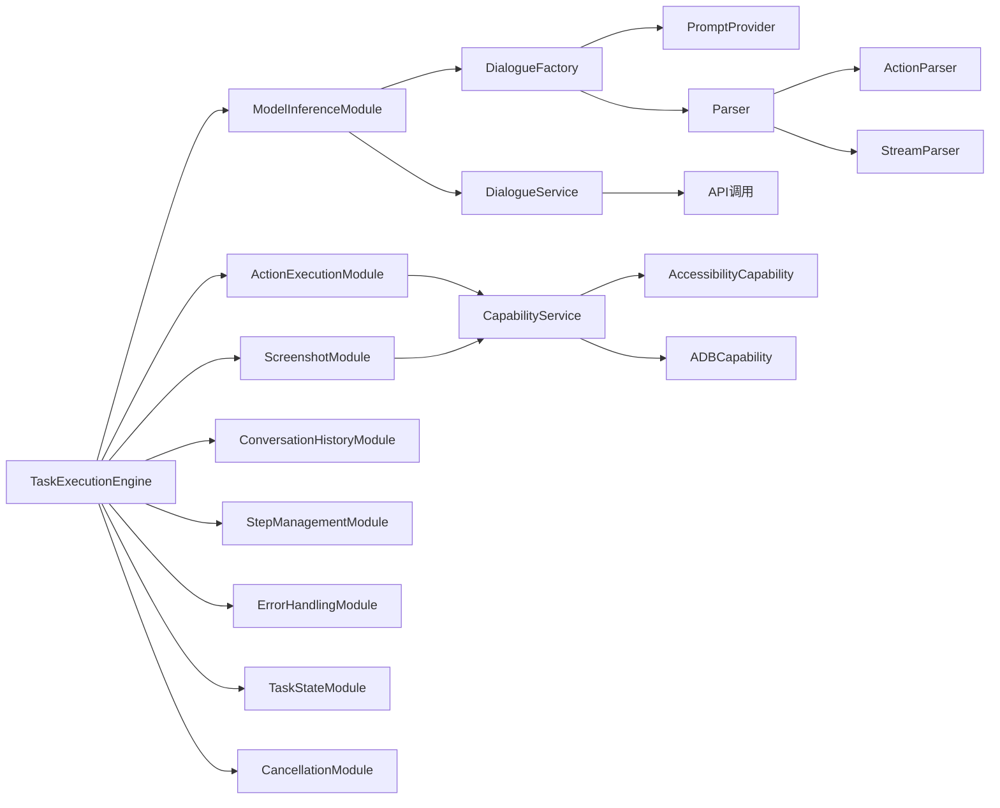
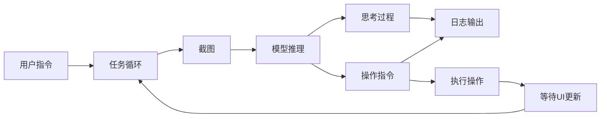
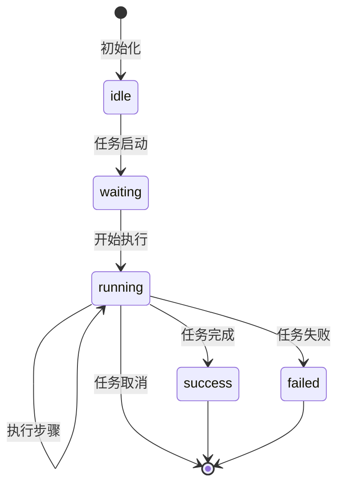
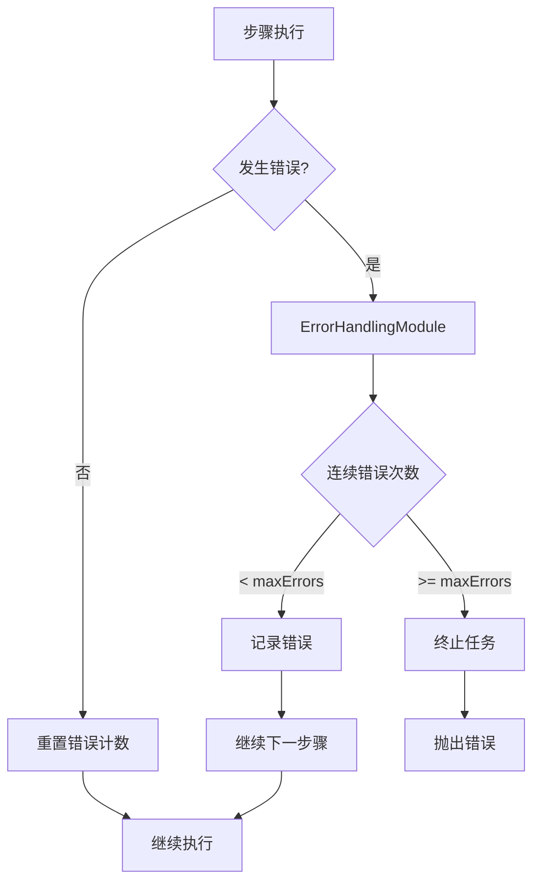
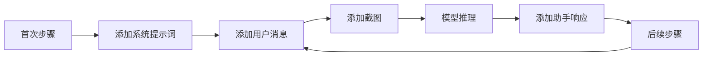
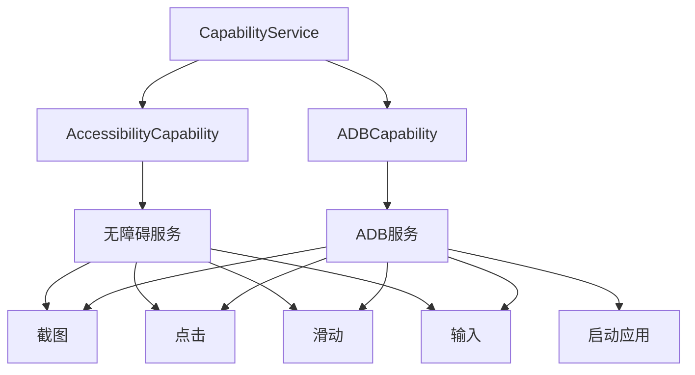

# 任务执行流程抽象图

## 主流程图



## 模型推理详细流程



## 操作执行流程



## 模块交互图



## 数据流图



## 状态转换图



## 错误处理流程



## 对话历史管理



## 能力服务架构



## 时间线图

```mermaid
gantt
    title 任务执行时间线
    dateFormat X
    axisFormat %s
    
    section 初始化
    初始化模块 :0, 1s
    前置初始化 :1s, 1s
    
    section 步骤1
    截图 :2s, 1s
    模型推理 :3s, 3s
    执行操作 :6s, 1s
    等待UI更新 :7s, 1s
    
    section 步骤2
    截图 :8s, 1s
    模型推理 :9s, 3s
    执行操作 :12s, 1s
    等待UI更新 :13s, 1s
```

