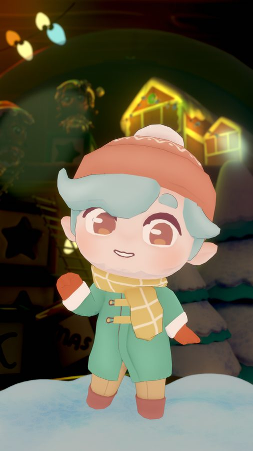
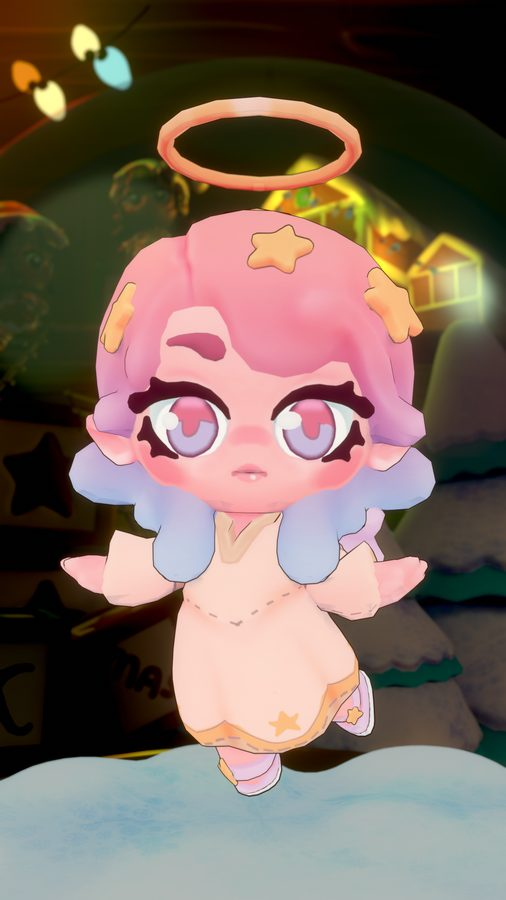

# 首页换成虚拟角色：交互方案与免费资源调研

> 结论先行：**可以换成虚拟角色，也有能直接内置的免费模型；但本项目面向 Android 7.0 低端机，默认首页不应上完整 3D VRM。**  
> 推荐路径：**2.5D 看板娘做默认交互层 + 用户可导入自己的 VRM + 中高端机可选 3D。**

## 已选定形象

**正选：Elel Silverbell**（Open Source Avatars · [Xmas Chibis](https://www.opensourceavatars.com/) · **CC0**）



- Q 版精灵，表情清楚，适合手机半身特写
- 青绿外套接近现有主色 `#2563EB`
- 整包 CC0：可改、可再分发、无需署名，能打进 APK
- VRM 直链：`https://dweb.link/ipfs/QmSpb8jZRtwDhpp7zjpfvU47GZyapmh8GvQApmzTxFcaLz/Avatar01_Neutral.vrm`

低端机第一期先用半身静图 / 轻量动画（已接入 `HomeScreen`，资源在 `AwesomeProject/src/assets/avatars/`），中高端再加载同一套 VRM。

**已接入：** 用户确认使用 Elel。首页问候文案换成 Elel 半身像 + 气泡，输入沉到底部 Dock。

**备选：Holy Garland**（同系列粉发天使，同样 CC0）



VRM：`https://dweb.link/ipfs/QmSpb8jZRtwDhpp7zjpfvU47GZyapmh8GvQApmzTxFcaLz/Avatar03_Neutral.vrm`

**不采用：** 100Avatars（Rose / Olivia / Erika 等）虽是 CC0，但是欧美低模 NFT 卡面风，和中文助手首页气质不合。VTubeMe 写实包要署名且面数更重，不当默认。模之屋模型不打进包。

可点原型（已换成 Elel）：[`design_demo_avatar.html`](../design_demo_avatar.html)

---

## 1. 现在首页在做什么

`HomeScreen` 是一张任务表单：问候文案 → 大输入框 → 快捷指令 chips → 执行时换成步骤卡片。

角色缺失的是「谁在替我干活」。把首页换成虚拟角色，不是换一张立绘，而是把 **指令入口从表单变成伴侣**。

约束（决定方案，而不是装饰）：

| 约束 | 影响 |
|------|------|
| Android 7.0+、百元机 / 旧机 | 完整 VRM（MToon + SpringBone + LookAt）默认开启会卡、发热、APK 膨胀 |
| 当前 RN 0.73，无 `expo-gl` / Filament | 没有现成 3D 渲染管线，要新增依赖和原生层 |
| 执行期会切到无障碍 / 悬浮窗 | 首页角色在干活时必须让出屏幕，不能一直占满 3D 视口 |
| 仓库协议 CC BY-NC 4.0 | App 本身不能商用；内置模型还要单独满足 **再分发** 条款 |
| 任务是「打开微信发消息」这类操作 | 角色要会报进度、道歉、要权限，而不是只做待机跳舞 |

---

## 2. 应该怎么交互

### 2.1 信息架构：角色是舞台，输入沉到底部

```
┌─────────────────────────┐
│  当前模型 / 电量提示      │  极简顶栏，不再用大标题问候
│                         │
│     气泡：「我在呢」       │
│                         │
│        [ 半身角色 ]       │  占屏 50–60%，可点、可看向手指
│                         │
│  [点外卖] [发微信] [买薯片] │  角色「推荐」而不是表单 chips
│ ┌─────────────────────┐ │
│ │ 想让我干什么…   🎤  ▶ │ │  底部 Dock，键盘弹出时角色上移缩小
│ └─────────────────────┘ │
│  首页   模型   历史   设置  │
└─────────────────────────┘
```

问候文案不要再占一整屏。「准备好执行任务了吗？」改由角色气泡说出，随状态变化。

### 2.2 六种角色状态（和现有任务状态一一对应）

| 状态 | 触发 | 表情 / 动作 | 气泡示例 |
|------|------|-------------|----------|
| **idle** 待机 | 进入首页、任务结束 | 呼吸、眨眼、偶尔歪头 | 「说一句，或点我开始听。」 |
| **listen** 倾听 | 点角色 / 点麦克风 | 身体前倾，注视用户 | 「我在听…」 |
| **think** 思考 | 已提交，模型还没吐出第一步 | 看向一侧，思考点 | 「让我想想怎么做…」 |
| **work** 执行 | 无障碍开始点按 | 专注、进度环 | 「正在打开微信…」 |
| **done** 完成 | 任务成功 | 笑、挥手 | 「搞定了，还要我做点别的吗？」 |
| **error** 失败 / 要权限 | 失败、无障碍未开、没配模型 | 歉意 / 指向设置 | 「先去打开无障碍，我才能动手。」 |

VRM 侧可直接映射到标准 BlendShape：`neutral / blink / aa / happy / sad / angry / relaxed`，外加 LookAt。没有 3D 时，用同一套状态机驱动 2.5D（Lottie / 序列帧 / CSS）。

### 2.3 手势与入口（按优先级）

1. **点角色** → 语音听写（本产品最该突出的入口；现在首页几乎看不见语音）
2. **底部输入框** → 键盘打字，保留给精确指令
3. **点气泡推荐** → 填入指令，不立刻执行（避免误触）
4. **长按角色** → 换形象 / 静音气泡 / 导入 VRM
5. **在角色区域拖动** → 3D 时旋转；2.5D 时给一个「被戳」的反馈动画
6. **LookAt** → 眼睛跟随手指或脸部方向（VRM 自带；2.5D 用瞳孔偏移模拟）

不要把「开始执行」做成角色身上的大按钮。角色负责 **接话**，Dock 里的发送键负责 **确认开工**。语音听完后用气泡复述：「你是说『给妈妈发微信』吗？」再让用户点发送或点头（二次确认，降低误操作）。

### 2.4 执行期：角色必须让路

本 App 执行任务时要截屏、点别人的界面。首页若还占着全屏 3D，既费电也挡操作。

推荐：

- **开始执行** → 半身角色缩成右下 / 悬浮窗里的 **头像 + 一句气泡**（与现有 `FloatingWindow` 合并）
- 步骤不再用首页大卡片当主界面；用户此时已经离开本 App
- **回到首页** → 角色还原，用表情复盘刚才的结果

低端机悬浮窗只用静态头像或 2 帧眨眼，不上 3D。

### 2.5 口型与语音（可后做）

当前代码里语音识别在 README 中有规划，首页尚未做成主入口。角色化之后：

- **听**：波形叠在角色胸口或耳机位置
- **说**（若以后加 TTS）：用 VRM 的 `aa / ih / ou / ee / oh` viseme；2.5D 用张嘴序列帧
- 没有 TTS 时，气泡文字逐字出现也能「像在说话」

### 2.6 换装与导入

首页长按角色弹出：

- 默认看板娘（2.5D，随 APK 分发，体积小）
- 1–2 个 **已内置、CC0** 的 VRM（仅中高端机加载）
- **从文件导入 VRM**（用户自己从模之屋 / VRoid Hub / BOOTH 下载）——这是最重要的增长点，也避开了我们替用户再分发模型的法律风险

---

## 3. 技术怎么落地（针对本仓库）

不要一上来接 `@pixiv/three-vrm` 当默认首页。现成方案和本项目的匹配度：

| 方案 | 优点 | 对本项目的问题 |
|------|------|----------------|
| WebView + `three.js` + `@pixiv/three-vrm` | 生态最成熟，LookAt / Expression 现成 | Android 7 WebView WebGL 能力差；和 RN 手势抢事件；内存高 |
| `react-native-filament` 加载 GLB | 原生线程渲染，老机相对稳 | 标准 Filament **不认 VRM 扩展 / MToon**；要自己做材质近似 |
| [VroidViewer](https://github.com/SmashinFries/VroidViewer)（Filament + three-vrm 算骨骼） | 最接近「App 里跑 VRM」 | 文档写明 **Android 12+**，JDK 21，直接打掉「7.0 低端机」定位 |
| Live2D Cubism / Spine / Lottie | 体积小、表情丰富、Android 7 能跑 | 不是 VRM；和用户自备 VRM 不通用 |
| **状态机 + 2.5D 默认，VRM 作可选渲染器** | 交互先做对，渲染可替换 | 需要把「角色状态」从 UI 里抽出来 |

推荐分层：

```
HomeScreen
  └─ AvatarStage
        ├─ AvatarStateMachine   idle|listen|think|work|done|error
        ├─ Renderer2D           默认：序列帧 / Lottie / CSS 半身
        ├─ RendererVRM          可选：WebView 或 Filament，按机型开关
        └─ AvatarDock           输入 + 语音 + 发送
FloatingWindow
  └─ 复用同一套状态机，只用头像渲染器
```

机型开关建议：

- API 24–27 或 RAM < 3GB → **只开 2.5D**
- API 28+ 且用户主动选了 VRM → 再加载 3D
- 任何时候 VRM 加载失败 → 静默回退 2.5D，不要白屏

体积：一个成品 VRM 常见 **8–40MB**。APK 默认只带 2.5D（几百 KB）+ 可选按需下载 CC0 VRM，不要把 4200 个模型打进包。

---

## 4. 免费资源能不能用

**能。** 但三条来源的用法完全不同：内置、署名后内置、只能让用户自己导入。

### 4.1 Open Source Avatars（首选内置来源）

- 站点：[opensourceavatars.com](https://www.opensourceavatars.com/)
- 数据仓库：[ToxSam/open-source-avatars](https://github.com/ToxSam/open-source-avatars)（登记册本身 CC0）
- 规模：4200+ VRM，在线预览、按风格筛选
- JSON（可程序化拉取，不必爬网页）：

```
https://raw.githubusercontent.com/ToxSam/open-source-avatars/main/data/projects.json
https://raw.githubusercontent.com/ToxSam/open-source-avatars/main/data/avatars/<collection>.json
```

每条 avatar 含 `model_file_url`（VRM 直链，多在 Arweave / IPFS）、`thumbnail_url`、所属 collection 的 `license`。

已核对、**整包 CC0** 的 collection（可商用、可改、可再分发、**无需署名**——内置进 APK 最省事）：

| Collection | `avatar_data_file` | 说明 |
|------------|--------------------|------|
| 100Avatars R1 / R2 / R3 | `avatars/100avatars-r*.json` | Polygonal Mind，约 300 个，VRM + voxel 变体 |
| Grifters Squaddies | `avatars/grifters-squaddies.json` | CC0 |
| ToxSam | `avatars/toxsam.json` | CC0 |
| Halloween Rising | `avatars/halloween-rising.json` | CC0 |
| Xmas Chibis | `avatars/xmas-chibis.json` | Q 版，较适合小屏幕半身 |
| NeonGlitch86 | `avatars/NeonGlitch86.json` | CC0 |

另有 **VIPE Heroes Genesis** 为 **CC-BY**（要署名）。

直链示例（CC0，Arweave 永久存储）：

- Devil（100Avatars R1）：`https://arweave.net/gfVzs1oH_aPaHVxpQK86HT_rqzyrFPOUKUrDJ30yprs`
- Polydancer：`https://arweave.net/jPOg-G0MPH55ZQmamFhT9f8cHn-hjeAQ0mRO5gWeKMQ`
- Rose：`https://arweave.net/Ea1KXujzJatQgCFSMzGOzp_UtHqB1pyia--U3AtkMAY`

注意：这批模型偏 **欧美卡通 / voxel / NFT 风**，不是国内二次元审美。当 **技术验证和「可合法内置」库存** 非常合适；当默认看板娘，需要挑 Q 版（如 Xmas Chibis）或自己画 2.5D。

开发者文档：<https://www.opensourceavatars.com/en/resources/developers/database>  
Mixamo → VRM 骨骼对照在仓库 `integrations/`（方便以后给角色加「挥手 / 思考」动作）。

### 4.2 VTubeMe 免费写实包（可内置，必须署名）

- 页面：<https://vtubeme.com/free-vrm-avatars>
- 四套现成写实全身：Nova、Kai、Sky、Ember
- 格式：VRM + GLB，自带面捕 BlendShape
- 授权：**CC BY 4.0** —— 个人/商用均可，允许修改和再分发，**必须署名为 VTubeMe 并链接 vtubeme.com**
- 无需注册、无水印
- 自拍生成自己的形象：预览免费，下载 **$7.99 / 个**

适合「虚拟客服 / 写实助手」视觉。写实模型面数和贴图通常比二次元更重，**更不适合当低端机默认首页**。若内置，设置页或关于页加一行：「写实形象来自 VTubeMe（CC BY 4.0）」。

自定义自拍模型 **不能** 当 App 默认形象再分发给所有用户。

### 4.3 模之屋（不要打进 APK）

- 站点：<https://www.aplaybox.com/>
- 国内 MMD / VRM 二创最集中的中文社区，二次元、国风、游戏 IP 都有
- 授权：**每个作品作者自定**。常见条款是禁止商用、禁止二次配布、禁止改模、仅限视频使用
- 下载通常要注册；部分稿件还限制「点赞收藏后才能下」
- 大量模型是游戏 / 动漫 IP 二创，**即使作者写了免费，也没有 IP 方授权**

对这个 App 的正确用法：

- **禁止** 把模之屋模型打包进仓库或 APK
- **允许** 「从文件导入」，用户对自己下载的文件负责
- 导入时读 VRM `meta`（`allowRedistribution`、`avatarPermission`、`commercialUssageName` 等）并展示，不替用户做合规承诺

模之屋官方看板娘另有单独约定（改模/再配布相对松，**商用需联系他们**）。即便可用，也不如 CC0 省事，且风格绑定官方 IP。

### 4.4 其他常见来源（补充）

| 来源 | 能否当默认内置 | 说明 |
|------|----------------|------|
| VRoid Hub | 基本不能 | 多数「仅个人使用」；Hub 下载 ≠ 允许你再分发 |
| BOOTH | 逐件看 | 很多付费或禁止再配布 |
| VRM 官方样例 Seed-san | **不要当 APK 内置默认角色** | [VRM Public License 1.0](https://vrm.dev/en/licenses/1.0/) + VirtualCast 约定：**禁止再配布原文件**；可改模后配布改编版。更适合做加载测试，不适合当产品形象 |
| Ready Player Me | 看其 TOS | 生成免费，再分发和品牌使用有额外条款 |
| 自己用 VRoid Studio 做 | 可以 | 版权在自己，最干净；导出 VRM 后仍建议再出一套 2.5D 低模 |

---

## 5. 建议怎么选（结合本项目）

```
默认首页形象
  ├─ 自己画 / 自己做的 2.5D 半身看板娘     ← 首选（体积、性能、版权都干净）
  ├─ OSA 里挑 1 个 CC0 Q 版 VRM 作「高清可选」← 合法内置，按机型加载
  └─ VTubeMe 四套写实                     ← 仅当产品要走写实风，且关于页署名

用户自己的形象
  └─ 导入本地 .vrm / .glb                 ← 覆盖模之屋、VRoid、约稿模型
```

**不要做的事：**

- 把 Open Source Avatars 的 4200 个模型做成应用内商城去「分发别人的文件」（即使 CC0，也没必要把 APK 变成网盘）
- 从模之屋扒模型当预置角色
- 在 Android 7 目标机上把 Filament VRM 做成必开能力
- 用 Seed-san 原文件当正式看板娘（再分发条款不合适）

---

## 6. 落地顺序（按侵入性）

1. **抽状态机，改首页布局**（不接 3D）  
   问候区换成 `AvatarStage` + 气泡；输入沉底；点角色 = 听写占位；执行时缩头像。  
   这一步就能验证「像不像伴侣」，和选哪个 VRM 无关。
2. **默认 2.5D**  
   Lottie 或 6 状态序列帧（待机呼吸、听、想、干、成、败）。体积控制在 1MB 内。
3. **导入本地 VRM**（中高端可选）  
   WebView + three-vrm 足够做实验；失败回退 2.5D。
4. **预置 1 个 CC0 VRM 按需下载**  
   从 OSA JSON 固定一个 Q 版 ID，首次使用再拉 Arweave。
5. **悬浮窗复用头像状态**  
   和现有前台服务 / 悬浮窗合并，而不是另开一套 Live2D。

配套可点原型：仓库根目录 [`design_demo_avatar.html`](../design_demo_avatar.html)（纯前端，演示六状态、点角色听写、LookAt、执行期缩头像）。

---

## 7. 参考链接

- Open Source Avatars 开发者 JSON：<https://www.opensourceavatars.com/en/resources/developers/database>
- OSA 数据仓库：<https://github.com/ToxSam/open-source-avatars>
- VTubeMe 免费模型：<https://vtubeme.com/free-vrm-avatars>
- 模之屋：<https://www.aplaybox.com/>
- `@pixiv/three-vrm`：<https://github.com/pixiv/three-vrm>
- VRM Public License 1.0：<https://vrm.dev/en/licenses/1.0/>
- Filament VRM RN Demo（Android 12+，仅作对照）：<https://github.com/SmashinFries/VroidViewer>
