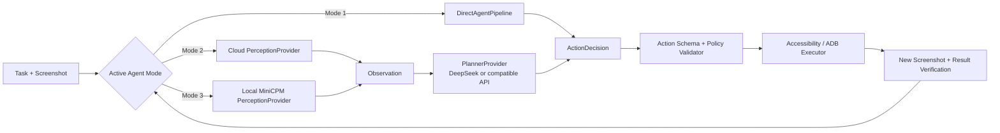

# Agent 配置与三种视觉执行模式设计

日期：2026-08-17
状态：已确认设计，待书面规格复核

## 1. 背景与结论

当前应用把截图、任务理解、动作生成都交给一个远端模型，模型配置也只有一个当前选中模型。新方案将页面升级为 **Agent 配置**，由用户选择运行模式，并在同一页面完成该模式所需的模型配置。

首版提供三种模式，默认使用模式 1：

| 模式 | 视觉理解 | 任务编排与动作决策 | API 密钥数量 |
| --- | --- | --- | ---: |
| 模式 1：云端 / 网关一体化 | 同一个云端或网关模型 | 同一个云端或网关模型 | 1 |
| 模式 2：云端视觉 + 云端编排 | 独立云端视觉模型 | 独立云端编排模型 | 2 |
| 模式 3：本地视觉 + 云端编排 | 客户端内 MiniCPM-V-4.6 | DeepSeek 或其他兼容模型 API | 1 |

模式 3 默认置灰，只有设备、模型包和真实推理自检全部通过后才允许选择。这个门禁使应用不必为了本地模型抬高全局最低系统版本，也避免不适合的设备进入不可用流程。

## 2. 目标与非目标

### 2.1 目标

- 让用户在一个“Agent 配置”页面理解并配置三种运行模式。
- 保留当前单模型使用方式，并无损迁移为模式 1。
- 将视觉理解与任务编排解耦，使 DeepSeek 可以替换为其他 API 模型。
- 在满足准入条件的 Android 设备上融合 MiniCPM-V-4.6 本地视觉能力。
- 三种模式复用同一套动作校验、执行、结果验证和风险确认机制。
- 密钥不再以明文保存在 AsyncStorage，也不得出现在日志和诊断包中。

### 2.2 非目标

- 首版不支持 iOS 本地 MiniCPM-V-4.6。
- 首版不允许任务执行中途自动切换模式或模型。
- 首版不做多个编排模型自动路由、竞速或投票。
- 本地视觉失败时不静默上传截图到云端；切换到云端模式必须由用户确认。
- MiniCPM-V-4.6 只负责感知，不直接执行点击、输入等设备动作。

## 3. 可行性与约束

MiniCPM-V-4.6 可以通过 OpenBMB 官方 MiniCPM-V-Apps 的 llama.cpp / mtmd 路径集成到 Android 客户端。官方移动端方案使用量化语言模型和独立视觉投影模型；Q4 模型约 0.5 GB、F16 mmproj 约 1.1 GB，安装后还需为缓存、校验和临时下载预留空间。官方建议设备至少具备 6 GB 内存，Android 侧要求 API 26+ 和 arm64。

现有项目的 Android 最低版本为 API 21，并已使用 arm64 ABI。设计因此采用能力门禁：模式 1、2 继续覆盖原有设备；只有 API 26+、arm64 且资源与推理检测通过的设备开放模式 3。MiniCPM 原生运行时作为独立模块接入，不改变云端模式的最低系统要求。

DeepSeek 是默认编排模型示例，不是硬编码依赖。编排层采用 OpenAI 兼容适配器和能力声明，可以接入支持结构化输出的 DeepSeek 或其他模型。

主要资料：

- [OpenBMB MiniCPM-V-Apps](https://github.com/OpenBMB/MiniCPM-V-Apps)
- [MiniCPM-V-Apps 硬件要求](https://github.com/OpenBMB/MiniCPM-V-Apps#hardware-requirements)
- [MiniCPM-V-4.6 模型页](https://huggingface.co/openbmb/MiniCPM-V-4.6)
- [DeepSeek API 模型与价格说明](https://api-docs.deepseek.com/quick_start/pricing/)
- [DeepSeek Thinking Mode](https://api-docs.deepseek.com/guides/thinking_mode/)

## 4. 页面与交互

### 4.1 页面结构

原“模型配置”入口和页面标题改为 **Agent 配置**。页面从上到下包含：

1. **运行模式**：三张模式卡片，显示处理链路、隐私特点和所需密钥数。
2. **模型配置**：根据当前模式动态展示配置卡片。
3. **运行参数**：最大步骤数、单步超时等公共参数；首版沿用现有默认值，不增加高级路由。
4. **保存与检测**：保存配置、测试连接；模式 3 另有“检测并启用”。

首次升级后默认选择模式 1。用户在三个模式之间切换时，每个模式保留自己的未激活配置草稿，避免来回切换导致已输入内容丢失；只有点击“保存并启用”才改变运行时配置。

### 4.2 各模式的模型配置

**模式 1：云端 / 网关一体化**

- 展示一张“一体化模型”配置卡。
- 字段：服务商、Base URL、模型名、API Key，以及可选的自定义请求头。
- 只需要一个 API Key；该模型同时理解截图、规划任务并给出下一步动作。

**模式 2：云端视觉 + 云端编排**

- 展示“视觉模型”和“编排模型”两张独立配置卡。
- 两张卡分别包含服务商、Base URL、模型名和 API Key，共两个密钥。
- 两个模型可以来自同一服务商，但连接和密钥仍独立保存、独立测试。
- 云端视觉模型接收截图并返回结构化观察；编排模型只接收观察、任务上下文和历史结果。

**模式 3：本地视觉 + 云端编排**

- 展示“本地视觉模型”状态卡和“云端编排模型”配置卡。
- MiniCPM-V-4.6 不显示 API Key，只显示模型版本、占用空间、下载/校验状态和最近检测结果。
- 云端编排模型配置一个 API Key，可选 DeepSeek 或其他兼容模型。
- 发送给云端编排模型的是结构化观察，不是原始截图。

### 4.3 保存与激活规则

- 模式 1 必须有一个完整且连接测试通过的一体化模型配置。
- 模式 2 的视觉模型和编排模型必须分别完整且连接测试通过。
- 模式 3 必须同时满足本地检测状态为 `ready`，且云端编排模型连接测试通过。
- 保存失败时保留用户输入，并在对应字段或配置卡内显示明确原因。
- 仅在任务空闲时允许切换已激活模式。运行中的任务使用启动时的不可变配置快照。
- 修改模型配置不会影响正在运行的任务；新配置从下一次任务开始生效。

## 5. 模式 3 准入检测

### 5.1 状态机

模式 3 使用以下状态：

| 状态 | 含义 | 是否可选 |
| --- | --- | --- |
| `unsupported` | 系统、架构或内存不满足硬条件 | 否 |
| `needs_download` | 设备可运行，但本地模型包未完整安装 | 否 |
| `needs_test` | 模型已安装，尚未完成或需要重跑自检 | 否 |
| `testing` | 正在加载模型并执行真实推理 | 否 |
| `ready` | 所有检测通过 | 是 |
| `failed` | 完整性、加载、推理正确性或性能未通过 | 否 |

置灰卡片仍可点击“查看原因”或“检测并启用”，但不能直接成为活动模式。

### 5.2 三层检测

1. **静态设备检测**
   - Android API 26 或更高。
   - ABI 为 arm64-v8a。
   - 设备总内存至少 6 GB。
   - 模型安装前可用存储至少 3 GB。
   - MiniCPM 原生库可加载，CPU 指令集满足运行时要求。
2. **模型完整性检测**
   - 模型文件与 mmproj 文件均存在。
   - 版本、文件大小和 SHA-256 与清单一致。
   - 下载采用临时文件，校验成功后再原子切换为活动版本。
   - 模型能够完成一次加载与释放，不发生 OOM 或原生崩溃。
3. **真实推理自检**
   - 使用应用内置、版本固定的测试截图执行一次视觉理解。
   - 输出必须符合 `Observation` Schema，并识别出预期文本和控件。
   - 单次预热后推理须在 15 秒内完成；超时判定为未通过。
   - 推理过程不得触发 ANR、OOM 或使原生进程异常退出。

检测结果绑定以下指纹：设备型号与 ABI、Android 大版本、应用原生运行时版本、模型版本及文件哈希。任一关键项变化后，状态回到 `needs_test`。用户可手动重新检测。

### 5.3 运行时失效

- 本地模型加载失败、OOM 或原生运行时异常时，立即停止生成新动作，将资格状态改为 `needs_test`。
- 当前任务进入暂停状态，提示用户重新检测或主动切换到模式 1/2。
- 不允许以“降级”为由静默上传当前截图。
- 普通的编排 API 超时不取消本地模型资格，只暂停当前任务并允许重试。

## 6. 运行时架构



### 6.1 组件边界

- `AgentRuntime`：读取已激活配置，创建任务级不可变快照，选择执行管线。
- `DirectAgentPipeline`：模式 1 的一体化调用，将截图、任务和上下文发送给单个多模态 Agent API。
- `PerceptionProvider`：把截图转换为 `Observation`；有云端和本地 MiniCPM 两种实现。
- `PlannerProvider`：把 `Observation`、任务目标和历史结果转换为一个 `ActionDecision`；DeepSeek 只是其中一个适配器。
- `ActionValidator`：验证动作 Schema、坐标范围、目标存在性、风险等级和循环限制。
- `ActionExecutor`：继续复用当前 Accessibility / ADB 动作执行能力。
- `ResultVerifier`：重新观察界面，判断预期状态是否实现，并将结果送入下一轮。
- `LocalModelEligibilityService`：负责模式 3 的检测状态机、模型版本指纹和失效处理。
- `CredentialStore`：用 Android Keystore 支持的安全存储保存密钥；业务配置只保存 `secretRef`。

这些接口让本地模型、云端视觉模型和编排模型可以分别替换，不要求任务引擎了解供应商细节。

## 7. 数据契约

### 7.1 结构化观察

```ts
interface Observation {
  schemaVersion: 1;
  app?: string;
  page?: string;
  stateSummary: string;
  visibleText: string[];
  elements: Array<{
    id: string;
    role: string;
    text?: string;
    bbox: [number, number, number, number]; // 0..1000 归一化坐标
    enabled: boolean;
    selected?: boolean;
    confidence: number;
  }>;
  uncertainties: string[];
}
```

视觉提供者必须生成稳定的元素 `id`。编排模型优先以 `targetId` 选择控件，只有无法建立稳定目标时才允许使用归一化坐标。

### 7.2 单步动作

```ts
interface ActionDecision {
  schemaVersion: 1;
  subtaskId: string;
  action: 'tap' | 'input' | 'swipe' | 'back' | 'wait' | 'finish' | 'ask_user';
  targetId?: string;
  coordinates?: [number, number];
  text?: string;
  expectedState: string;
  risk: 'low' | 'medium' | 'high';
}
```

每轮只生成并执行一个动作，然后重新截图和验证。任务排序可以在首次规划时生成语义子任务及依赖关系，但不得一次输出一串基于旧截图的坐标动作。

### 7.3 Agent 配置

```ts
type AgentMode =
  | 'cloud_direct'
  | 'cloud_split'
  | 'local_vision_cloud_planner';

interface AgentConfigV2 {
  version: 2;
  activeMode: AgentMode;
  modeDrafts: {
    cloudDirect: { modelConnectionId?: string };
    cloudSplit: {
      visionConnectionId?: string;
      plannerConnectionId?: string;
    };
    localVisionCloudPlanner: {
      localModelId: 'minicpm-v-4.6-q4';
      plannerConnectionId?: string;
    };
  };
  maxSteps: number;
}

interface ModelConnection {
  id: string;
  providerId: string;
  baseUrl: string;
  modelName: string;
  secretRef: string;
  capabilities: {
    vision: boolean;
    jsonOutput: boolean;
    toolCalls: boolean;
    thinking: boolean;
  };
}
```

页面以内嵌配置卡呈现这些字段，持久化层则把连接标准化，既能兼容旧模型记录，也便于以后复用。编排适配器依据能力声明选择 JSON 输出、工具调用或推理模式；普通单步任务默认使用非思考模式，复杂恢复可以显式启用高推理模式。

## 8. 旧配置迁移与密钥安全

升级时执行幂等的 V1 → V2 迁移：

1. 将当前 `selectedModelId` 对应的 `AIModel` 转换为 `ModelConnection`。
2. 创建 `AgentConfigV2`，`activeMode` 设为 `cloud_direct`，并让模式 1 引用该连接。
3. 其他已有模型也转换为可复用连接记录，不删除用户配置。
4. 先把 API Key 写入安全存储并读回验证，再把业务记录改为 `secretRef`。
5. 只有安全存储写入和配置提交都成功后，才清除 AsyncStorage 中的明文密钥；失败时保留旧数据并回滚本次迁移。

迁移后用户第一次打开 Agent 配置页时，应看到原先选中的模型已填入模式 1，无需重新输入密钥。新增供应商列表必须统一来自 provider registry，修复当前新增/编辑页面与已支持供应商不一致的问题，使 DeepSeek 等已有 provider 能正常选择。

产品自有的公共密钥不下发到客户端；这类连接必须经过业务网关代理。用户自带密钥使用设备安全存储，并在 UI 中只显示掩码和最后四位。

## 9. 调用与错误处理

### 9.1 模式 1

- 一体化模型接收截图、目标和必要历史，返回单个 `ActionDecision`。
- API 超时或 Schema 解析失败时按现有退避策略有限重试；仍失败则暂停任务。
- 所有返回动作仍需通过公共校验，不因模型“一把梭”而绕过安全层。

### 9.2 模式 2

- 视觉调用失败时不调用编排模型，也不执行动作。
- 编排调用失败或返回非法动作时不执行动作，可重试或由用户修改配置。
- 编排请求默认不附带原始截图，只包含 `Observation` 和任务上下文。

### 9.3 模式 3

- 本地感知失败按第 5.3 节处理，不自动切换云端视觉。
- 云端编排失败时保留本地模型资格，只暂停或重试当前步骤。
- 任何日志只记录模型标识、耗时、错误码和脱敏摘要，不记录密钥、完整截图或敏感输入文本。

### 9.4 公共安全规则

- 转账、支付、删除、授权、发送消息等高风险动作执行前必须二次确认。
- 连续界面无变化、重复动作或超过最大步骤数时停止循环并请求用户处理。
- `targetId` 不存在、坐标越界、置信度不足或预期状态缺失时拒绝执行。

## 10. 与现有代码的衔接

首轮实现只改造与本功能直接相关的边界：

- 将 `ModelInferenceModule` 中“截图直接调用单模型”的逻辑下沉到 `AgentRuntime` 和不同 Pipeline。
- `DialogueService` 不再无条件附带截图，而由活动模式决定请求载荷。
- 扩展 `shared/types/Model.ts`，增加 Agent 配置、连接能力和结构化契约。
- 把当前 `storage.ts` 中带明文 API Key 的模型持久化迁移到安全凭据引用。
- 新增/编辑模型页面改为共享 provider registry，消除 DeepSeek 已在 API provider 层支持、但 UI 类型和选项缺失的问题。

不在本次范围内重写任务执行器或 Accessibility / ADB 基础设施。

## 11. 测试与验收

### 11.1 自动化测试

- 单元测试：V1 → V2 幂等迁移、各模式必填校验、资格状态机、Schema 解析、动作风险校验。
- 原生测试：模型下载中断恢复、哈希失败、加载/取消/释放、低内存和错误模型文件。
- 集成测试：三种模式分别通过 mock provider 完成观察—规划—执行—验证闭环。
- 隐私测试：模式 3 的编排请求不含图片；模式 2 的编排请求默认不含图片。
- 安全测试：AsyncStorage、应用日志和诊断包中不出现完整 API Key。
- 并发测试：任务运行期间禁止改变活动模式，当前任务使用配置快照。

### 11.2 设备矩阵

- API 21–25：模式 1、2 正常，模式 3 显示不支持原因。
- API 26+、arm64、4 GB RAM：模式 3 置灰并显示内存不足。
- API 26+、arm64、6/8/12 GB RAM：覆盖下载、检测、运行、释放和重新检测。
- 覆盖低存储、无网络、下载中断、后台切换、温升和系统回收场景。

### 11.3 功能验收标准

1. 新装和升级后活动模式均为模式 1；升级用户的原模型配置可直接使用。
2. 模式 1 配置区恰好需要一个密钥；模式 2 恰好两个；模式 3 恰好一个云端编排密钥。
3. 未达到 `ready` 的设备无法选中模式 3，卡片清楚说明原因和下一步。
4. `ready` 结果因应用原生运行时、模型哈希或 Android 大版本变化而失效并要求复测。
5. 三种模式生成的动作都经过同一 Schema 与风险校验后才执行。
6. 模式 3 的截图始终留在本地，除非用户明确切换到云端视觉模式并重新启动任务。
7. DeepSeek 可以被另一个满足能力要求的兼容 API 模型替换，无需改动任务引擎。
8. 旧明文密钥成功迁入安全存储，迁移失败不会丢失原配置。

## 12. 上线观察指标

- 每种模式的任务成功率、单步成功率和人工接管率。
- 视觉输出 Schema 合格率、动作 Schema 合格率、重复动作停止次数。
- 云端调用端到端耗时与错误率。
- 本地模型冷启动、预热后推理耗时、峰值内存、OOM、崩溃和 ANR。
- 模式 3 检测通过率及按设备型号聚合的失败原因。
- 电量和温升只做分档统计，不上传截图或用户输入内容。

模式 3 首发应采用灰度开关；若特定机型的崩溃、ANR 或 OOM 超出阈值，可通过机型黑名单暂停准入，而不影响模式 1、2。
