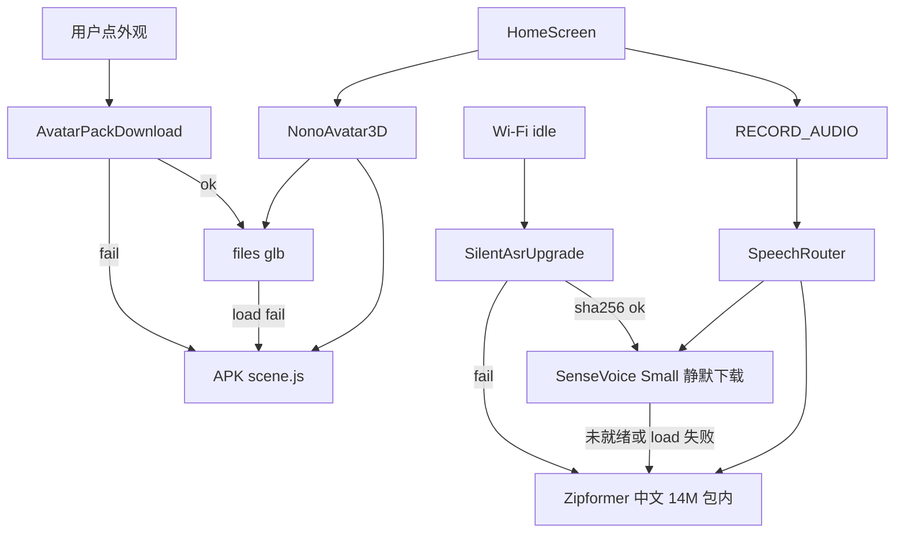

# NoNo 本地 3D 角色包与离线听写设计

日期：2026-08-19（2026-08-20 修订听写：SenseVoice Small 静默下载 → Zipformer 中文 14M 包内保底；不用系统识别）

## 1. 目标

安装包必须自带两份永远能用的本地能力，用户打开就能看见立体角色、点角色就能说话：

1. 程序化 3D 默认角色（WebView + 本地 Three.js，禁止 CDN）。
2. 听写：优先静默下载的 SenseVoice Small，失败再用安装包里的 Zipformer 中文 14M。Zipformer 随包，保证断网也能出字。

后续增强走下载，失败一律回滚到安装包内的默认实现，用户对听写升级无感知。

不变量：

1. 运行时 JS（`three.min.js`、`GLTFLoader`、`avatar.html`、`scene.js`、Sherpa JNI）只来自安装包，永不下载、永不走 CDN。
2. 首页冷启动先渲染内置 3D，再尝试当前外观包；失败仍是 3D，不变扁图标、不白屏。
3. 点角色即可听写。不依赖下载完成、不用演示话轮冒充识别成功。单次开口链路固定为 **SenseVoice Small → Zipformer 中文 14M**。
4. SenseVoice Small 仅在 Wi-Fi 下静默下载；移动网络不下。下载、校验、加载失败时跳过这一档，无进度、无弹窗。
5. 角色外观包由用户点选后才下载，可走移动网络，有确认和进度。失败回滚到内置 3D。
6. 角色包、听写包、陪伴/操作/MiniCPM 模型列表互不共用存储与 UI。
7. 不用 Android `SpeechRecognizer`、不用 `ACTION_RECOGNIZE_SPEECH`、不绑定小爱/小布/Jovi/Bixby、不接华为 ASR SDK、不静默走自有云端听写。音频只进端侧 Sherpa。
8. MiniCPM 视觉包（约 1.6GB）不套用听写的静默升级。

## 2. 非目标

- 本版不做 iOS 角色包下载、iOS 离线听写接线。Android（小米 9 / API 30）为验收机。
- 本版不播骨骼动画。清单可写 `wave` / `nod` / `talk` clip 名，加载器忽略。
- 本版不实现系统听写、云端听写开关、自有云端 ASR、华为 HiAI/HMS、鸿蒙 Core Speech Kit。
- 「大模型」= SenseVoice Small（静默下载）。「小模型」= Zipformer 中文 14M（APK 内）。都不是陪伴对话 LLM。出字之后的对话仍走陪伴模型。
- 本版不把下载来的 `scene.js` 当外观包。外观只允许 `glb` + 清单。
- 本版不把听写结果自动执行手机操作。文本交给首页既有确认/陪伴路由；操作通道仍走独立设计。
- 本版不改 MiniCPM 下载确认策略。

## 3. 当前问题

- 3D 已用 APK 内 `file:///android_asset/nono-avatar/` 渲染程序化角色，但路径写死，不能换包，也没有失败回滚状态机。
- 首页 `startVoiceListen` 用 2.6 秒定时器轮换 `DEMO_TURNS`，没有麦克风、没有 ASR。
- README 所称「默认开源离线语音识别」在代码中不存在。
- 原型 HTML 曾用 jsDelivr；App 侧已改为本地 `three.min.js`。后续加载器（GLTFLoader）必须同样打进 APK。

## 4. 总体架构

两套包共用同一原则，目录和策略分开：

```text
APK 只读运行时
  ├─ assets/nono-avatar/   three.min.js + GLTFLoader.js + avatar.html + scene.js
  └─ assets/nono-asr/      Zipformer 中文 14M（builtin）

应用私有目录（可删、可再下）
  ├─ files/nono/avatars/{id}/   manifest.json + model.glb
  └─ files/nono/asr/{id}/       SenseVoice Small 等下载文件

选择状态（AsyncStorage，不含密钥）
  ├─ avatar.activeId    "builtin" | 已校验外观 id
  └─ asr.activeId       始终先解析为可用包；增强未就绪则 builtin
```



## 5. 角色 3D

### 5.1 运行时

`NonoAvatar3D` 只加载 APK 内 `avatar.html`。页面提供：

- `setLayout` / `setMood` / `setLook`（现有）
- `loadGltf(fileUrl)`：用包内 GLTFLoader 加载；成功则隐藏程序化网格，失败则调用 `useBuiltin()` 并 `postMessage({type:'avatar-load-failed', id})`
- `useBuiltin()`：销毁 glb 根节点，重新显示程序化默认角色

首页先 `useBuiltin()` 出画，再按 `avatar.activeId` 尝试 `loadGltf`。

### 5.2 外观包格式

每个外观包是一个目录，不得含 JS：

```ts
interface AvatarManifestV1 {
  schemaVersion: 1;
  id: string; // 非 "builtin"
  version: string;
  title: string;
  files: {
    model: {name: 'model.glb'; bytes: number; sha256: string};
  };
  clips: {
    wave?: string;
    nod?: string;
    talk?: string;
  };
}
```

`clips` 本版不播放。目录内文件集合必须与清单一致，多文件视为损坏。

### 5.3 目录与切换

内置项 `builtin` 出现在列表顶部，不可删除、不可下载。

其它项来自应用内钉死的 `AvatarArtifactPins`（id、标题、url、bytes、sha256），不是开放商店。用户点选后：

1. 确认（Wi-Fi / 移动网络都要确认，因为这是用户主动要的包）。
2. 下载到临时文件，校验长度与 sha256。
3. 原子搬到 `files/nono/avatars/{id}/`。
4. 写入 `avatar.activeId`。
5. 首页加载 glb。

失败：不改 `activeId`（若已是该 id 则改回 `builtin`），删除损坏目录，界面回到内置 3D。

未点选的外观包不得预下载、不得静默下载。

## 6. 听写

开口一句短文本。只走端侧 Sherpa-ONNX，JS 消费统一事件。不用 Android 系统识别，不用通用 RN 语音插件当唯一实现。

优先级：

1. **SenseVoice Small**（`asr.upgrade`）：Wi-Fi 静默下载后再用。
2. **Zipformer 中文 14M**（`asr.builtin`）：打进 APK，最终保底。

钉死产物（k2-fsa GitHub Release，不是 JS CDN）：

| 档 | id | 官方包 | 约体积 | 引擎 |
| --- | --- | --- | ---: | --- |
| SenseVoice Small | `upgrade` | `sherpa-onnx-sense-voice-zh-en-ja-ko-yue-int8-2024-07-17.tar.bz2` | 155.5MB | Offline SenseVoice（int8，源自 SenseVoiceSmall） |
| Zipformer 中文 14M | `builtin` | `sherpa-onnx-streaming-zipformer-zh-14M-2023-02-23-mobile.tar.bz2` | 51.8MB | Online Zipformer 流式 |

url / bytes / sha256 在实现合入前写入 `AsrArtifactPins`。

SenseVoice 按短句离线识别（VAD 切句或停说后 decode）。Zipformer 走流式 `OnlineRecognizer`。首页都是「正在听」直到出 final。同一句不跨引擎热切：SenseVoice 在 load 前失败则同一次点按改 Zipformer；已经开始录音则本句结束，下一句再选档。

### 6.1 开口路径

1. 点角色。操作任务执行中则忽略。
2. 无麦克风：请求；拒绝则说明，不听、无假文本。
3. `upgradeReady` 且 load 成功 → SenseVoice；否则 Zipformer。
4. partial（Zipformer）或等待切句（SenseVoice）更新「正在听」；final 进确认/陪伴路由。禁止 `DEMO_TURNS`。

小米 9 飞行模式必须能出字（SenseVoice 未下完时用 Zipformer）。

### 6.2 静默升级

`SilentAsrUpgrade` 在前台或回到 Wi-Fi 时尝试下载 SenseVoice Small 官方 tar：

- 仅 Wi-Fi；
- 尚未通过校验；
- 可用空间 ≥ archiveBytes × 2 + 50MB；
- 不与角色包共用 part 文件名。

无通知、无进度。校验通过后 `asr.upgradeReady=true`。失败删临时文件，继续用 Zipformer。移动网络 / 未知网络 / 飞行模式不下。

说到一半不热切换。下一句重新解析：SenseVoice 就绪则用它，否则 Zipformer。

## 7. 错误处理

| 情况 | 用户可见 | 系统行为 |
| --- | --- | --- |
| 无网冷启动 | 内置 3D，可听写 | 不请求任何外观/听写 URL |
| glb 哈希失败或 GLTF 抛错 | 内置 3D | `activeId=builtin`，删坏包 |
| 拒麦克风 | 权限说明 | 不听、无假文本 |
| SenseVoice 未就绪或 load 失败 | 无 | 走 Zipformer |
| Zipformer 初始化失败 | 明确失败，可打字 | 重试解压 assets；禁止 DEMO |
| SenseVoice 下载/校验失败 | 无 | 不影响 Zipformer |
| 角色下载取消或失败 | 列表保持未装，角色仍是当前可用项 | 不改其它包 |

WebView / JNI 不得加载 http(s) 脚本。日志不写本地文件绝对路径以外的用户语音原文到非调试通道；调试日志可留 final 文本长度，不强制留全文。

## 8. 测试

验收机：小米 9，断网与 Wi-Fi 各跑一遍。

角色：

- 断网冷启动首页是立体默认角色；抓包无 jsDelivr / unpkg / cdnjs。
- 点一个钉死的外观包：有确认和进度；成功后外观变化。
- 将已装 `model.glb` 截断后杀进程再开：回到内置 3D。
- 未点过的外观不会出现在磁盘目录。

听写：

- 装完立刻点角色：权限通过后能出字，无下载 UI。引擎为 Zipformer（SenseVoice 尚未就绪）。
- 飞行模式能出字（Zipformer）。
- Wi-Fi 后台完成 SenseVoice 后，下一句引擎为 `upgrade`，仍无下载 UI。
- 人为损坏 SenseVoice 文件：无弹窗，下一句仍出字，引擎为 Zipformer。
- 代码中不存在 `DEMO_TURNS` 成功路径，也不存在 `SpeechRecognizer` / `ACTION_RECOGNIZE_SPEECH`。

边界：

- 移动网络不产生听写 upgrade 的网络请求。
- 陪伴模型列表与角色列表、听写包不是同一 UI。

## 9. 文件边界

| 模块 | 职责 |
| --- | --- |
| `NonoAvatar3D` + `avatar.html` / `scene.js` | 只读运行时与 builtin 网格 |
| `AvatarPackStore` | 外观目录、校验、activeId |
| `AvatarArtifactPins` | 钉死的外观 url/哈希 |
| `SpeechRouter` | SenseVoice Small → Zipformer 14M |
| `SherpaAsrModule` | SenseVoice 离线短句 + Zipformer 流式 JNI |
| `AsrModelStore` | Zipformer 解压与 SenseVoice 校验 |
| `SilentAsrUpgrade` | Wi-Fi 静默下载 SenseVoice Small |
| `HomeScreen` | 权限、听写 UI、把 final 文本交给现有确认流 |

不把外观或听写包写入现有 `@autoglm:models` / `@nono:models:*`。
