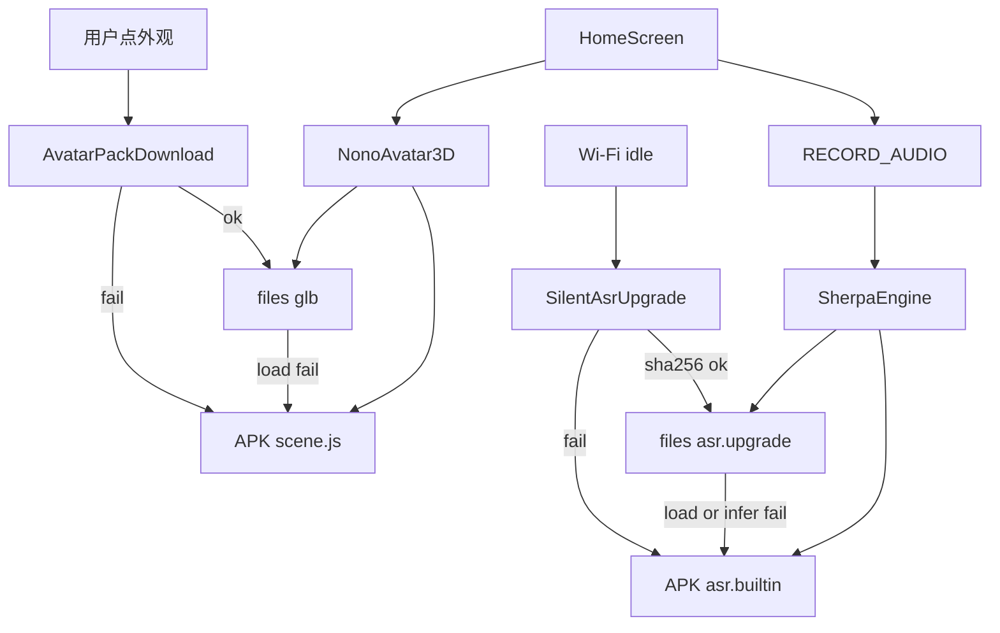

# NoNo 本地 3D 角色包与离线听写设计

日期：2026-08-19

## 1. 目标

安装包必须自带两份永远能用的本地能力，用户打开就能看见立体角色、点角色就能说话：

1. 程序化 3D 默认角色（WebView + 本地 Three.js，禁止 CDN）。
2. 中文离线流式听写（Sherpa-ONNX，模型在 APK assets 内）。

后续增强走下载，失败一律回滚到安装包内的默认实现，用户对听写升级无感知。

不变量：

1. 运行时 JS（`three.min.js`、`GLTFLoader`、`avatar.html`、`scene.js`、Sherpa JNI）只来自安装包，永不下载、永不走 CDN。
2. 首页冷启动先渲染内置 3D，再尝试当前外观包；失败仍是 3D，不变扁图标、不白屏。
3. 点角色即可听写。不依赖下载完成、不依赖云、不用演示话轮冒充识别成功。
4. 听写增强模型仅在 Wi-Fi 下静默下载；移动网络不下。下载、校验、加载失败时继续用包内模型，无进度、无弹窗。
5. 角色外观包由用户点选后才下载，可走移动网络，有确认和进度。失败回滚到内置 3D。
6. 角色包、听写包、陪伴/操作/MiniCPM 模型列表互不共用存储与 UI。
7. 本地听写失败不静默改走云端听写或系统听写。
8. MiniCPM 视觉包（约 1.6GB）不套用听写的静默升级。

## 2. 非目标

- 本版不做 iOS 角色包下载、iOS 离线听写接线。Android（小米 9 / API 30）为验收机。
- 本版不播骨骼动画。清单可写 `wave` / `nod` / `talk` clip 名，加载器忽略。
- 本版不实现云端听写开关或云端 ASR 调用。后续若加，只能是用户显式打开，且失败必须退回包内听写。
- 本版不把下载来的 `scene.js` 当外观包。外观只允许 `glb` + 清单。
- 本版不把听写结果自动执行手机操作。文本交给首页既有确认/陪伴路由；操作通道仍走独立设计。
- 本版不改 MiniCPM 下载确认策略。

## 3. 当前问题

- 3D 已用 APK 内 `file:///android_asset/nono-avatar/` 渲染程序化角色，但路径写死，不能换包，也没有失败回滚状态机。
- 首页 `startVoiceListen` 用 2.6 秒定时器轮换 `DEMO_TURNS`，没有麦克风、没有 ASR。
- README 所称「默认开源离线语音识别」在代码中不存在。
- 原型 HTML 曾用 jsDelivr；App 侧已改为本地 `three.min.js`。后续加载器（GLTFLoader）必须同样打进 APK。

## 4. 总体架构

两套包共用同一原则，目录和策略分开：

```text
APK 只读运行时
  ├─ assets/nono-avatar/   three.min.js + GLTFLoader.js + avatar.html + scene.js
  └─ assets/nono-asr/      sherpa-onnx 小模型（builtin）

应用私有目录（可删、可再下）
  ├─ files/nono/avatars/{id}/   manifest.json + model.glb
  └─ files/nono/asr/{id}/       增强听写模型文件

选择状态（AsyncStorage，不含密钥）
  ├─ avatar.activeId    "builtin" | 已校验外观 id
  └─ asr.activeId       始终先解析为可用包；增强未就绪则 builtin
```



## 5. 角色 3D

### 5.1 运行时

`NonoAvatar3D` 只加载 APK 内 `avatar.html`。页面提供：

- `setLayout` / `setMood` / `setLook`（现有）
- `loadGltf(fileUrl)`：用包内 GLTFLoader 加载；成功则隐藏程序化网格，失败则调用 `useBuiltin()` 并 `postMessage({type:'avatar-load-failed', id})`
- `useBuiltin()`：销毁 glb 根节点，重新显示程序化默认角色

首页先 `useBuiltin()` 出画，再按 `avatar.activeId` 尝试 `loadGltf`。

### 5.2 外观包格式

每个外观包是一个目录，不得含 JS：

```ts
interface AvatarManifestV1 {
  schemaVersion: 1;
  id: string; // 非 "builtin"
  version: string;
  title: string;
  files: {
    model: {name: 'model.glb'; bytes: number; sha256: string};
  };
  clips: {
    wave?: string;
    nod?: string;
    talk?: string;
  };
}
```

`clips` 本版不播放。目录内文件集合必须与清单一致，多文件视为损坏。

### 5.3 目录与切换

内置项 `builtin` 出现在列表顶部，不可删除、不可下载。

其它项来自应用内钉死的 `AvatarArtifactPins`（id、标题、url、bytes、sha256），不是开放商店。用户点选后：

1. 确认（Wi-Fi / 移动网络都要确认，因为这是用户主动要的包）。
2. 下载到临时文件，校验长度与 sha256。
3. 原子搬到 `files/nono/avatars/{id}/`。
4. 写入 `avatar.activeId`。
5. 首页加载 glb。

失败：不改 `activeId`（若已是该 id 则改回 `builtin`），删除损坏目录，界面回到内置 3D。

未点选的外观包不得预下载、不得静默下载。

## 6. 离线听写

### 6.1 引擎与包

- 引擎：Sherpa-ONNX Android JNI，流式中文识别。
- `asr.builtin`：随 APK `assets/nono-asr/` 发布。首次启动解压到 `files/nono/asr/builtin/`（若已存在且哈希匹配则跳过）。这是听写的唯一保底。
- `asr.upgrade`：钉死的更大流式中文模型。仅 Wi-Fi、仅后台、无 UI。

具体官方产物的 url、bytes、sha256 必须在听写实现合入前写成 `AsrArtifactPins`，与 MiniCPM 产物钉死方式相同。设计不绑定某个会过期的第三方 CDN 文件名以外的运行时加载路径。

### 6.2 开口路径

1. 点角色。若正在执行操作任务则忽略。
2. 无麦克风权限：系统请求；拒绝则只说明需要麦克风，不进入听、不产出假文本。
3. 初始化当前可用听写包：优先 `asr.upgrade`（文件齐且哈希通过且引擎 load 成功），否则 `asr.builtin`。
4. 流式 partial 更新首页「正在听」文案；endpoint 后给出 final 文本。
5. 文本进入首页确认/陪伴路由。禁止再使用 `DEMO_TURNS` 作为成功结果。

包内模型必须在小米 9 断网条件下能产生非空 final 文本。这是 P0，不能用「先下再用」替代。

### 6.3 静默升级

`SilentAsrUpgrade` 在应用进入前台或回到 Wi-Fi 时尝试：

- 网络是 Wi-Fi；
- `asr.upgrade` 尚未通过校验；
- 磁盘空间足够（钉死阈值：可用空间 ≥ 升级包 bytes × 2 + 50MB）；
- 不与角色包用户下载抢同一临时文件名。

过程不展示通知、横幅、进度。校验通过后置 `asr.upgradeReady=true`。解析规则：仅当 `upgradeReady` 且引擎 load 成功时使用 upgrade，否则 builtin；load 失败则把 `upgradeReady` 打回 `false` 并删坏文件。允许下次 Wi-Fi 再下。

不得在移动网络、未知网络、飞行模式下下载。云端听写不是这条链路的一部分。

说到一半时不热切换模型。当前 utterance 用开口时选中的引擎实例，下一句再读 `asr.activeId`。

## 7. 错误处理

| 情况 | 用户可见 | 系统行为 |
| --- | --- | --- |
| 无网冷启动 | 内置 3D，可听写 | 不请求任何外观/听写 URL |
| glb 哈希失败或 GLTF 抛错 | 内置 3D | `activeId=builtin`，删坏包 |
| 拒麦克风 | 权限说明 | 不听、无假文本 |
| builtin ASR 初始化失败 | 明确失败，可打字 | 重试解压 assets；禁止 DEMO |
| upgrade 下载/校验/load 失败 | 无 | 继续 builtin，稍后 Wi-Fi 重试 |
| 角色下载取消或失败 | 列表保持未装，角色仍是当前可用项 | 不改其它包 |

WebView / JNI 不得加载 http(s) 脚本。日志不写本地文件绝对路径以外的用户语音原文到非调试通道；调试日志可留 final 文本长度，不强制留全文。

## 8. 测试

验收机：小米 9，断网与 Wi-Fi 各跑一遍。

角色：

- 断网冷启动首页是立体默认角色；抓包无 jsDelivr / unpkg / cdnjs。
- 点一个钉死的外观包：有确认和进度；成功后外观变化。
- 将已装 `model.glb` 截断后杀进程再开：回到内置 3D。
- 未点过的外观不会出现在磁盘目录。

听写：

- 装完立刻点角色：权限通过后能出字，无下载 UI。
- 飞行模式能出字。
- Wi-Fi 后台完成 upgrade 后，下一句仍无下载 UI，且 `asr.activeId` 为 upgrade。
- 人为损坏 upgrade 文件：无弹窗，下一句仍出字，引擎为 builtin。
- 代码中不存在将 `DEMO_TURNS` 当作识别成功的路径。

边界：

- 移动网络不产生听写 upgrade 的网络请求。
- 陪伴模型列表与角色列表、听写包不是同一 UI。

## 9. 文件边界

| 模块 | 职责 |
| --- | --- |
| `NonoAvatar3D` + `avatar.html` / `scene.js` | 只读运行时与 builtin 网格 |
| `AvatarPackStore` | 外观目录、校验、activeId |
| `AvatarArtifactPins` | 钉死的外观 url/哈希 |
| `SherpaAsrModule` | JNI 流式识别 |
| `AsrModelStore` | builtin 解压与 upgrade 校验 |
| `SilentAsrUpgrade` | Wi-Fi 静默下载 |
| `HomeScreen` | 权限、听写 UI、把 final 文本交给现有确认流 |

不把外观或听写包写入现有 `@autoglm:models` / `@nono:models:*`。
