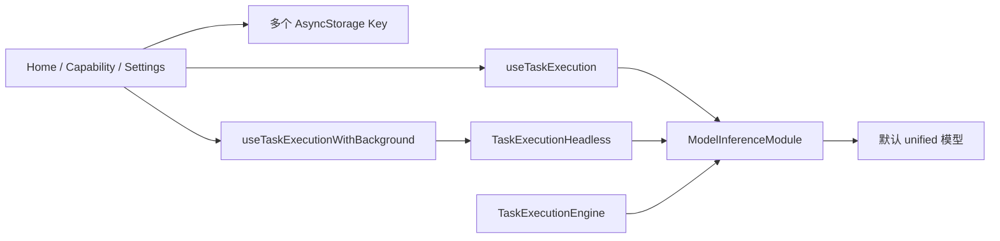
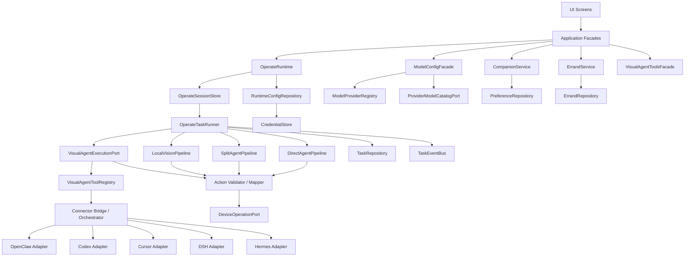

# V1 功能补齐、架构调整与多子 Agent 并行交付方案

日期：2026-08-20

状态：方案已批准，实施计划文档已按多视觉 Agent 工具与双模式模型配置补充；尚未开始实施

代码基线：`V1` / `9ff7ba4cc4dc186b79b6e62181333ae6c9132f54`

## 1. 结论

V1 已完成 NoNo 的主要 UI、导航和交互外壳，但运行时仍基本沿用旧版“单模型、单任务、三套执行循环”的实现。界面中出现的云端双模型、本地视觉、视觉 Agent 工具、交代任务、记忆位置、真实陪伴语音和外观包等能力，大部分还没有形成生产闭环。OpenClaw 只是首个视觉 Agent 工具代表，不再作为运行时中的特殊能力名称。

推荐采用“**V1 保持为产品基线 + 契约先行 + 既有 Agent Runtime 选择性移植 + 三个编码子 Agent 并行 + 一个集成协调 Agent 统一验收**”的方式推进。

不建议把现有 `codex/agent-runtime-phase1` 或 `codex/nono-ui-runtime-integration` 整分支直接合入 V1。它们与 V1 的共同祖先较早，包含大量 UI 删除、旧文件重写和原生层变动。正确做法是按模块和依赖顺序移植已经验证的实现，并让 V1 当前 UI 通过稳定 Facade 接入。

并发原则：

- 最多同时运行三个编码子 Agent，加一个主协调/集成 Agent。
- 子 Agent 只修改自己的文件域，不直接修改共享热点。
- 共享热点由集成 Agent 在每个 wave 结束后串行接线。
- 每个 wave 只有通过统一门禁后，才能成为下一 wave 的共同基线。
- 最终验收由独立测试 Agent 执行，编码 Agent 不给自己的工作签发最终 PASS。

## 2. 审查范围与证据

本方案基于以下实时证据：

- V1 当前提交：`9ff7ba4 feat: add NoNo companion UI, capability pages, and local 3D avatar`。
- V1 相比 `master` 新增/修改 72 个文件，主要集中于 UI、能力页、模型列表、3D 角色和交互原型。
- V1 当前没有生产目录 `src/core/engine/agentRuntime/`。
- V1 已有三处独立模型推理循环：
  - `features/task/hooks/useTaskExecution.ts`
  - `features/task/services/TaskExecutionHeadless.ts`
  - `core/engine/taskEngine/task/TaskExecutionEngine.ts`
- `TaskExecutionEngine` 当前只有导出和文档引用，没有成为前台/后台唯一执行入口。
- `codex/agent-runtime-phase1` 已具备 Agent Runtime、统一执行适配器、凭据存储和本地模型基础；只读验证结果：
  - Agent Runtime：14 个测试套件、147 个用例通过。
  - 执行器与前后台适配：5 个测试套件、88 个用例通过。
- V1 全量 Jest/TypeScript 基线当前不是绿色，详见第 5 节。

## 3. V1 功能缺口

### 3.1 功能状态总表

| 功能 | UI 状态 | 当前真实能力 | 主要缺口 | 优先级 |
| --- | --- | --- | --- | --- |
| 云端一体操作 | 已有配置与入口 | 仍使用旧 `unified` 单模型执行链，可基本运行 | 前后台执行重复、配置不是任务快照、密钥边界不安全 | P0 |
| 云端视觉 + 云端编排 | UI 可分别配置两类模型 | 运行时不读取 `activeMode`，仍取默认 `unified` 模型 | 缺 Perception/Planner pipeline、结构化观察、隐私投影、统一动作校验 | P0 |
| 本地视觉 + 云端编排 | UI 有 MiniCPM 状态卡与编排模型 | 页面明确写着本机运行时未接通，并会继续走云端一体模型 | 缺本地模型下载、校验、资格检测、JNI 推理和 fail-closed 行为；当前回退语义与隐私承诺冲突 | P0 |
| 模式保存与激活 | UI 可保存 `activeMode`/`draftMode` | 仅写独立 AsyncStorage key | 执行时不消费模式；没有 revision、配置快照、任务期间模式锁和原子激活 | P0 |
| 视觉 Agent 工具 | 只有 OpenClaw 开关、地址、设备和集群展示 | 只有 OpenClaw 本地配置；页面明确“远程会话尚未接通” | 核心概念被硬编码为 OpenClaw；缺统一能力协商、任务状态、审批、取消和断线语义；Codex、Cursor、DSH、Hermes 无接入点 | P1 |
| 陪伴对话 | 有独立陪伴模型配置与首页角色入口 | 首页通过定时器轮播 `DEMO_TURNS` | 未调用 ASR、陪伴模型、意图路由或真实流式回复 | P1 |
| 语音听写 | UI 有“正在听”状态 | 固定 2.6 秒后返回演示文本 | 缺真实录音、权限、ASR 路由、取消、错误恢复；离线 ASR 目前只有设计/计划 | P1 |
| 记忆 | 有开关、位置、列表、忘记操作 | 使用带种子数据的本地 `MemoryItem[]` | `memoryEnabled` 未约束首页读取/写入；远程位置未绑定选中的视觉 Agent profile；偏好与交代混在同一仓储 | P1 |
| 交代任务 | 有开关、单次/定时、编辑/取消 | 只保存本地记录 | 无自然语言解析、时间解析、调度、lease、到点唤醒、执行、重试和完成推进 | P1 |
| 隐私页 | 已展示各通道数据说明 | 主要是说明文案和 AsyncStorage 设置 | 真实执行没有统一数据分类、日志脱敏、Planner 投影和截图/密钥落盘防线 | P0 |
| 模型管理 | 多列表 CRUD 已完成 | 可保存/选择模型；仓库内已有未接线的厂商和模型选择组件 | Add/Edit 各自硬编码厂商；目录服务与运行 transport 不一致；API Key 仍在 `AIModel.apiKey`；provider、endpoint、model、credential、role 被压在一个对象中 | P0 |
| 前台/后台任务 | UI 有执行卡、历史和中断 | 前台 hook 与 Headless 各自执行循环 | 同一任务可能走不同逻辑；后台失败会回退前台并创建新的执行所有权风险 | P0 |
| 取消与通知 | 有中断按钮和系统通知 | 使用全局 `taskId: 'current'`、固定通知 ID 和全局资源清理 | 不能安全区分多个任务；事件、WakeLock、服务和浮窗不是 task-scoped | P0 |
| 任务历史 | 有活动页、详情、筛选 | 基本读写可用 | 读改写无串行队列，二级索引容易失配；测试语义与实现不一致 | P0 |
| 3D 角色外观 | 首页可显示 3D、设置页可预览/选择 | 使用内置 WebView 资源和内存演示清单 | 选择/安装不是完整持久化包流程；缺下载、哈希、原子切换、回滚和资源预算 | P2 |
| 调试日志 | 已有日志页 | 仍存在直接记录模型响应、任务数据和错误对象的路径 | 缺统一 `sanitizeLog` 与敏感字段/图片数据防落盘测试 | P0 |

### 3.2 关键证据

1. 首页加载操作模型时调用 `modelService.getSelectedModel()`，没有读取 Agent 模式或对应模型列表；因此三模式 UI 没有进入运行时路由。
2. 首页语音由 `DEMO_TURNS` 和 `setTimeout` 驱动，不是 ASR 或 Companion API。
3. OpenClaw 页面只读写 `NonoConfigService`，没有任何生产连接器；`capability/types.ts`、记忆位置和页面路由也把视觉 Agent 工具硬编码为 OpenClaw。
4. Headless payload 包含 `instruction` 和完整 `model`，其中包括 `apiKey`。
5. 前台、Headless 和 `TaskExecutionEngine` 都直接调用 `modelInferenceModule.infer()`。
6. 取消事件使用 `TaskCancelRequested` 和 `taskId: 'current'`，原生服务通知 ID 固定为 1001/1002，说明现有执行生命周期只适合单任务所有权。
7. `NonoConfigService` 把能力、隐私、模式、OpenClaw、记忆分散保存在多个 key 中，无法一次读取出一致的任务级路由快照。
8. `ApiProviderSelector.tsx`、`ModelNameSelector.tsx` 和 `ModelListService.ts` 已实现部分“厂商选择/模型列表”，但 Add/Edit 全部没有引用；三处厂商清单彼此漂移，Edit 还按 URL 猜厂商并把持久化的 API Key 回填 React state。
9. 当前执行层只按 OpenAI-compatible `/chat/completions` 调用模型；即使 UI 能列出 Anthropic 等厂商，运行时也没有对应 wire-protocol adapter，不能把“可配置”误当作“可执行”。

## 4. 根因：不是缺几个按钮，而是 UI 与运行时分层断开

V1 的主要问题不是页面缺失，而是页面状态没有通过稳定的应用服务进入运行时。

当前调用关系近似为：



问题表现：

- UI 可以配置多种模式，但执行层仍只认识一个 `AIModel`。
- 前台和后台各自拥有循环、历史、取消、通知和资源清理。
- 配置、凭据、任务 session、历史、记忆和交代都由 AsyncStorage 业务对象直接承载。
- Screen/Hook 既负责交互，也负责路由、权限、执行、回退和资源清理。
- 新功能继续接在 Screen 上会造成更多隐式共享状态，无法安全并行开发。

## 5. 工程基线问题

### 5.1 当前验证结果

V1 当前 Jest 结果：

- 4 个 V1 新增 UI 测试套件通过。
- 总体为 5 个套件失败、4 个套件通过。
- `TaskHistoryService` 有 3 个断言失败。
- 两个工具测试仍引用迁移前的 `src/utils/*` 路径。
- `useTaskHistory` 测试依赖未安装的 `@testing-library/react`，项目实际安装的是 `@testing-library/react-native`。
- App 测试没有正确转换或 mock `react-native-vector-icons`。

TypeScript 当前至少存在：

- `HomeScreen` 从 Root Stack 直接导航到 Tab route `Capabilities` 的类型错误。
- 未跟踪的 Agent Runtime 契约测试引用尚不存在的生产模块。
- 旧测试路径和依赖类型错误。

### 5.2 处理原则

在功能并行开发前必须先建立可信基线：

- 明确哪些失败属于生产缺陷，哪些属于旧测试失效。
- 不允许通过忽略整个目录来制造“绿色”。
- 先让 V1 原有能力在不包含新增功能测试时全绿。
- 新功能测试必须先红后绿，并绑定到对应 work package。
- 每个 wave 的基线 SHA、测试清单和已知豁免必须记录。

## 6. 三种交付路线

### 方案 A：直接合并既有集成分支

做法：把 `codex/nono-ui-runtime-integration` 或更后的 `codex/nono-task-surfaces-integration` 直接 merge 到 V1。

优点：

- 可能最快获得大量既有能力。
- 已有测试和原生实现较完整。

缺点：

- 与 V1 共同祖先较早，差异包含数百个文件级变化。
- 会删除或覆盖 V1 新 UI、Avatar、ASR 文档和能力页面。
- 冲突解决无法区分“真正设计变更”和“分支演化差异”。
- 统一验收成本最高。

结论：不推荐。

### 方案 B：在 V1 上契约先行，选择性移植既有 Runtime

做法：冻结 V1，先落地稳定契约与验收测试，再按 `contracts → providers/pipelines → session/runner → native/security → UI facade` 的顺序移植既有实现。

优点：

- 保留 V1 UI 与用户体验。
- 能复用已经通过 235 个相关测试的 Agent Runtime 和执行器实现。
- 文件所有权清晰，适合多子 Agent 并行。
- 每一波都能独立回滚和验收。

缺点：

- 需要重新做一次 V1 接口适配。
- 共享热点必须由集成 Agent 串行处理。

结论：推荐。

### 方案 C：完全在 V1 重写 Runtime

做法：只参考文档，不复用既有分支代码。

优点：

- 可以得到最整洁的 V1 原生设计。
- 没有历史分支移植包袱。

缺点：

- 重复实现凭据、本地模型、provider、pipeline、执行器和大量测试。
- 时间最长，回归风险高。
- 容易再次出现“UI 先行、运行时滞后”。

结论：除非既有 Runtime 审计不通过，否则不采用。

## 7. 推荐目标架构



### 7.1 分层职责

| 层 | 允许做什么 | 禁止做什么 |
| --- | --- | --- |
| UI Screen/Component | 展示、表单、调用 Facade、订阅 ViewState | 直接读取 provider、执行动作、保存密钥、启动循环 |
| Application Facade | 把 UI intent 转成明确用例，返回稳定状态 | 持有截图/模型响应历史 |
| Domain | 定义配置、session、任务、错误码、数据分类 | import React Native、AsyncStorage 或原生桥 |
| Runtime | 创建不可变 session，选择 pipeline，拥有唯一循环 | 从当前 UI 状态临时猜测模型/通道 |
| Provider/Pipeline | 按 registry 适配 OpenAI、Anthropic、Gemini 等 wire protocol，完成感知/规划组合 | 用 provider ID 猜 parser；直接执行设备动作 |
| Visual Agent Adapter | 把统一 task/session/event/approval/cancel 映射到工具原生协议 | 把某一工具的 heartbeat、resume 或 transport 强加给其他工具 |
| Connector Bridge | 在桌面/服务端托管 CLI、ACP、JSON-RPC、HTTP/SSE、WebSocket 连接与长期工具密钥 | 让移动端直接启动本机 CLI 或持有工具 owner token |
| Policy/Mapper | Schema、坐标、风险和隐私校验 | “尽量执行”非法动作 |
| Infrastructure | AsyncStorage、CredentialStore、原生桥、网络 | 向上泄漏平台细节和原始错误对象 |

### 7.2 必须建立的核心契约

- `RuntimeConfigEnvelopeV1`：一次持久化所有会影响路由的能力、模式、模型 binding 和视觉 Agent profiles，带 `revision` 与原子 `compareAndActivate`。
- `ResolvedOperateSessionV1`：任务开始时生成的不可变快照，只保存 `secretRef`，不保存 API Key。
- `ProviderPresetV1` 与 `ModelProviderRegistry`：热门厂商、endpoint profile、wire protocol、auth scheme、目录策略和 API Key 指南的唯一事实源。
- `ModelEndpointProfileV1` 与 `ModelBindingV1`：把 endpoint/credential 与厂商 model ID/业务 role 分离，允许一个连接被多个 role 复用。
- `ProviderExecutionTargetV1`：session 创建时把 profile、preset registration 与 model capability 归一化为不可变 protocol/baseURL/auth/chatPath/ref/capability DTO；runner/transport 不再读取 live profile 或用新版 registry 重算。
- `ProviderTransportAdapter`：至少明确 OpenAI Chat/Responses、Anthropic Messages、Gemini native 和 custom 协议；禁止把所有厂商强制当作 OpenAI-compatible。
- `ProviderModelCatalogPort`：返回 `ready | unsupported | auth_failed | network_failed | empty`，支持取消、分页、缓存和 stale 语义；`ready` 表示当前凭证、区域和渠道的完整可见集合，不表示厂商全球全量模型。
- `OperateTaskRunner`：唯一拥有“截图 → 推理 → 校验 → 确认 → 动作 → 观察”的循环。
- `TaskInstructionPort`：runner 通过 `taskId` 读取用户指令，Headless payload 不携带原始指令。
- `TaskEvent`：所有事件必须带 `taskId`、`sessionRevision`、`sequence` 和明确 event type。
- `TaskRepository`：所有写入串行化，同一 taskId 幂等，终态不可逆。
- `CredentialStore`：Android Keystore / iOS Keychain；业务模型只保存引用。
- `CredentialRetirementRepository` + cold-start `CredentialReferenceGarbageCollector`：replace/remove 只把旧 ref 放入持久 retirement queue；App 在恢复所有非终态 session 后、接受新任务前，按 active/draft config 与非终态 session 的 ref 并集做 GC。这样运行中修改/删除 profile 不会提前删掉当前任务快照依赖的凭据。
- `PreferenceRepository` 与 `ErrandRepository`：分开生命周期，不能继续共用 `MemoryItem[]`。
- `VisualAgentToolAdapter` 与 `VisualAgentToolRegistry`：统一 handshake、能力协商、图片输入、结构化动作、任务关联、审批、取消、稳定错误与审计；OpenClaw、Codex、Cursor、DSH、Hermes 是首批内置 adapter。
- `VisualAgentExecutionPort`：只暴露 `connect / disconnect / execute / cancel / resolveApproval / resume / steer / requestPreferences / subscribe` 的能力化上层语义；不支持的能力必须显式返回 `visual_agent_capability_unsupported`，断开时 fail-closed，不回退本地 pipeline。
- `VisualAgentAdapterConformance`：任何其他视觉 Agent 工具必须通过相同的 manifest/version、correlation、privacy、cancel、fail-closed 和 credential-boundary 测试后才能注册。

### 7.3 视觉 Agent 工具接入规则

推荐采用“统一上层协议 + 工具专属 adapter + 安全 Connector Bridge”，而不是五套 UI 特例或仅依赖 MCP/ACP：

| 工具 | 首选接入面 | 计划中的成熟度边界 |
| --- | --- | --- |
| OpenClaw | Gateway WebSocket；OpenResponses 只作为兼容调用 | Gateway token 只留在 Bridge；webhook 200 只表示接收，不表示完成 |
| Codex | SDK 或 `codex exec`；富事件客户端可选 App Server | CLI/SDK 运行在桌面或服务端；App Server WebSocket 属 experimental，不作为永久生产合同 |
| Cursor | ACP/SDK；持久云任务可选 Cloud Agents API | ACP 是 stdio；CLI/Cloud API beta，权限回调不能被绕过 |
| DSH | DeepSeek Harness adapter | 当前按 DeepSeek Harness 定义并标记 developer preview；版本变化由 adapter compatibility range 隔离 |
| Hermes | Runs API/HTTP+SSE 或 TUI Gateway；IDE 场景可用 ACP | 不把 `hermes mcp serve` 当成完整 Agent 执行接口 |

协议依据必须在 adapter 实现评审时重新核对官方版本：[OpenClaw Gateway protocol](https://github.com/openclaw/openclaw/blob/main/docs/gateway/protocol.md)、[Codex App Server](https://learn.chatgpt.com/docs/app-server)、[Codex non-interactive mode](https://learn.chatgpt.com/docs/non-interactive-mode)、[Cursor ACP](https://prod.cursor.com/docs/cli/acp)、[Cursor Cloud Agents API](https://prod.cursor.com/docs/cloud-agent/api/endpoints)、[DeepSeek Harness](https://github.com/deepseek-ai/deepseek-harness)、[Hermes programmatic integration](https://hermes-agent.nousresearch.com/docs/developer-guide/programmatic-integration)。用户已确认本方案中的 DSH 指 DeepSeek Harness。

`VisualAgentCapabilitySet` 精确声明八个协商布尔值：`imageInput`、`structuredAction`、`stream`、`cancel`、`approval`、`steer`、`resume`、`preferences`。操作模式的最低资格是 `imageInput === true` 且 `structuredAction === true`；未知能力在 adapter negotiation 前视为不支持，不能激活。统一状态机为 `queued | running | waiting_approval | completed | failed | cancelled`。图片输入表示把截图作为 Agent 上下文，并不承诺稳定检测框、OCR 坐标或独立 CV 结果。

系统允许保存多个 `VisualAgentProfileV1`，但每个 `ResolvedOperateSessionV1` 只快照一个 `profileId + toolId + connector{bridgeUrl,bindingId,secretRef} + negotiatedCapabilities`。Profile 新建/编辑使用显式 `keep | replace | remove` credential intent：编辑默认 keep，不把 secret 读回 UI；replace 先安全存储和回读校验再 CAS，失败只清理新 ref；成功 replace/remove 把旧 ref 提交到 retirement queue，而不是立即删除。运行中修改 active profile 只影响新任务；旧 ref 仅在 cold-start GC 证明 active/draft config 与所有非终态 session 均不再引用时删除。Gateway、CLI、ACP、JSON-RPC 和 HTTP/SSE 的私有参数只存在 Bridge-owned binding 中。

### 7.4 API 厂商与模型目录规则

模型配置顶层只有两种模式：

1. `preset`：OpenAI、Anthropic、Google Gemini、DeepSeek、xAI、阿里云百炼/Qwen、智谱 GLM、Moonshot/Kimi、MiniMax、火山方舟/Doubao，并为现有 ModelScope 数据保留兼容 preset。
2. `custom`：允许配置 label、Base URL、OpenAI Chat/OpenAI Responses/Anthropic Messages/Gemini native 协议、认证位置、chat path、可选 models path、model ID 与用户声明的模态；默认只允许 HTTPS，跨主机重定向不转发认证头。

厂商存在官方模型枚举接口时，目录按凭证、region/workspace/channel、API version 和不可逆 key fingerprint 隔离缓存，拉完所有分页后原子替换；厂商没有接口时使用版本化签名静态清单。静态清单只补充 display name、模态、生命周期和兜底推荐，始终保留手动 model ID。UI 文案使用“当前凭证可用模型”，不得承诺跨区域、跨套餐或跨协议的厂商全球全量模型。

目录策略以官方接口为准，例如 [OpenAI Models API](https://developers.openai.com/api/reference/resources/models/methods/list)、[Anthropic List Models](https://platform.claude.com/docs/en/api/models/list)、[Gemini Models API](https://ai.google.dev/api/models)、[DeepSeek List Models](https://api-docs.deepseek.com/api/list-models/)、[xAI Models API](https://docs.x.ai/developers/rest-api-reference/inference/models) 和 [Moonshot/Kimi List Models](https://platform.kimi.com/docs/api/list-models)。百炼、智谱和火山方舟没有等价的移动端通用推理 `/models` 时，计划必须走签名静态清单或自有后端管控面，不能在 App 内抓取厂商 HTML 页面或持有 AK/SK。

## 8. 多子 Agent 并行开发模型

### 8.1 角色

| 角色 | 数量 | 职责 |
| --- | ---: | --- |
| 主协调/集成 Agent | 1 | 冻结契约、分配文件域、维护集成分支、串行修改热点、运行 wave gate、处理冲突 |
| 编码子 Agent | 最多 3 | 在独立 worktree/分支完成单一 work package，只修改获授权文件域 |
| 测试 Agent | 1，验收阶段独立启用 | 写统一测试计划、跑自动化、模拟真实用户路径、输出 PASS/FAIL/WAIVED 证据 |
| 评审 Agent | 1，提交前启用 | 基于集成快照做代码/架构评审，不与编码 Agent 共享结论 |

测试 Agent 和评审 Agent 可以复用已结束编码 Agent 的并发槽，但不能由对应实现者自审自签。

### 8.2 分支与 worktree 规则

- 集成分支：`codex/v1-runtime-integration`，只由主协调 Agent 修改。
- 工作分支使用明确的 wave/package 名称，例如 `codex/v1-w1a-runtime-core`、`codex/v1-w2a-visual-agent-core`、`codex/v1-w2b-codex-cursor-adapters`。
- 每个工作包使用独立 worktree，全部从该 wave 的统一基线 SHA 创建。
- 子 Agent 不 merge 其他工作分支，不修改集成分支。
- 子 Agent 交付一个或少量按依赖拆分的 commit，不提交无关格式化。
- 主协调 Agent 按依赖顺序 cherry-pick；每次 pick 后运行该包的 targeted gate。
- 一个 wave 全部通过后创建 integration checkpoint，再作为下一 wave 基线。
- 工作包交付必须附带：基线 SHA、提交 SHA、文件列表、测试命令、测试结果、已知限制、迁移/回滚说明。

### 8.3 共享热点单一所有者

以下文件不得由多个子 Agent 并发修改，默认只允许集成 Agent在接线阶段修改：

- `AwesomeProject/src/features/task/screens/HomeScreen.tsx`
- `AwesomeProject/src/features/task/hooks/useTaskExecution.ts`
- `AwesomeProject/src/features/task/useTaskExecutionWithBackground.ts`
- `AwesomeProject/src/features/task/services/TaskExecutionHeadless.ts`
- `AwesomeProject/src/core/engine/taskEngine/task/TaskExecutionEngine.ts`
- `AwesomeProject/src/features/model/services/ModelService.ts`
- `AwesomeProject/src/shared/types/Model.ts`
- `AwesomeProject/src/shared/constants/apiProviders.ts`
- `AwesomeProject/src/features/model/services/ModelListService.ts`
- `AwesomeProject/src/features/model/components/ApiProviderSelector.tsx`
- `AwesomeProject/src/features/model/components/ModelNameSelector.tsx`
- `AwesomeProject/src/features/model/screens/AddModelScreen.tsx`
- `AwesomeProject/src/features/model/screens/EditModelScreen.tsx`
- `AwesomeProject/src/features/model/components/ModelListPanel.tsx`
- `AwesomeProject/src/features/settings/screens/APIKeyGuideScreen.tsx`
- `AwesomeProject/src/features/capability/services/NonoConfigService.ts`
- `AwesomeProject/src/features/capability/screens/OpenClawScreen.tsx`
- `AwesomeProject/src/features/capability/types.ts`
- `AwesomeProject/src/shared/utils/storage.ts`
- `AwesomeProject/src/navigation/AppNavigator.tsx`
- Android/iOS 原生模块注册文件

子 Agent 如需这些入口，必须提供新模块、接口和接线说明，由集成 Agent统一接入。

## 9. 推荐开发 waves

### Wave 0：冻结基线与契约（串行）

负责人：主协调 Agent。

目标：

1. 冻结 V1 SHA，处理或登记当前未跟踪文件，不覆盖用户工作区。
2. 修复/分类现有 Jest 与 TypeScript 基线。
3. 建立第 7.2–7.4 节的纯类型契约、provider/visual-agent registry consistency 和架构 guard tests。
4. 建立统一验收清单与 evidence 模板。
5. 明确 phase1 中允许移植的提交/文件，不整分支合并。

Gate：

- V1 保留功能测试全绿。
- `npx tsc --noEmit` 全绿。
- 架构 guard tests 能阻止 Screen 直接 import provider/runner。
- 契约不依赖 React Native 和具体 provider。

### Wave 1：Runtime 基础分两轮并行移植

Wave 1A 的三个编码子 Agent 从 Wave 0 checkpoint 并行工作：

| 子 Agent | 工作包 | 独占文件域 | 主要产出 |
| --- | --- | --- | --- |
| A | Agent Runtime Core | `core/engine/agentRuntime/domain|providers|pipelines|policy/**` | Direct/Split pipeline、隐私投影、动作校验 |
| B | Task History | TaskHistory 与新的 instruction port | 并发安全历史、按 taskId 读取指令、无敏感持久化 |
| C | Native & Security | `agentRuntime/credentials|localModel/**`、Android/iOS 新模块文件 | CredentialStore、本地模型资格/下载/校验、原生超时边界 |

Wave 1A 集成通过后，Wave 1B 的三个编码子 Agent 从同一新 checkpoint 并行工作：

| 子 Agent | 工作包 | 独占文件域 | 主要产出 |
| --- | --- | --- | --- |
| A | Runtime Config + Model Provider | 新配置、provider registry/catalog、迁移文件与测试 | active/draft envelope、profile/binding、preset/custom、`secretRef`、原子 `compareAndActivate` |
| B | Immutable Sessions | `operateRuntime/session/**` | 不可变 task/session 快照、lease 与恢复 |
| C | Unique Runner | `operateRuntime/runner/**` | 唯一多步 owner、取消与单终态 |

必须串行接线：

- 主协调 Agent 在 A/C 接口稳定后，把 B 接入现有任务引擎。
- 原生模块注册只由主协调 Agent 修改。
- 不在本 wave 修改 Home/能力页交互。

Wave 1 Gate：

- phase1 对应 235 个已验证测试在 V1 移植后等价通过。
- 前台/Headless 使用同一 runner 和 session。
- Headless payload 只含 `{taskId, sessionRevision}`。
- API Key 不进入 AsyncStorage、taskData、日志和任务历史。
- preset/custom 配置可回读；目录的成功、不支持、鉴权失败、网络失败和空集合不会再被同一个 `[]` 混淆。
- Anthropic/Gemini 不通过 OpenAI-compatible transport 假运行；custom 的未知协议可保存但明确 blocked。
- local vision 失败时云端视觉调用次数为零。

### Wave 2A：独立领域与视觉 Agent Core 并行实现

三个编码子 Agent 从 Wave 1 checkpoint 并行工作，不直接修改 UI 热点。

| 子 Agent | 工作包 | 文件域 | 主要产出 |
| --- | --- | --- | --- |
| A | Companion + Intent | `core/engine/companion/**`、`features/companion/**` | 真实对话、意图分类、proposal/confirmation、禁止截图/动作 |
| B | Errand | `core/engine/errand/**`、`features/errand/**` | 独立仓储、时间模型、lease、due sweep、单次/周期状态机 |
| C | Visual Agent Bridge Core + Profile | `connectorBridge/visualAgent/{ports,protocol}/**`、`features/visualAgent/{data,application}/**` | 校验 Runtime 冻结的九项契约、Bridge codec、profile controller、只读 migrated-OpenClaw projection；不拥有 migration，不重定义协议/registry |

### Wave 2B：内置 Adapter 三路并发

Wave 2A Gate 通过后建立独立 checkpoint，再开启 Wave 2B 的三路 adapter 并发；每个 worker 只修改自己的 adapter 子目录：

| 子 Agent | 工作包 | 独占文件域 | 主要产出 |
| --- | --- | --- | --- |
| A | OpenClaw | `connectorBridge/visualAgent/adapters/openclaw/**` | Gateway WS 映射、认证、取消、审批和事件 codec；复杂度单独成包 |
| B | Codex + Cursor | `connectorBridge/visualAgent/adapters/codex/**`、`connectorBridge/visualAgent/adapters/cursor/**` | SDK/exec/App Server 与 ACP/SDK/Cloud 映射，显式保留 experimental/beta 成熟度 |
| C | DSH + Hermes | `connectorBridge/visualAgent/adapters/dsh/**`、`connectorBridge/visualAgent/adapters/hermes/**` | DeepSeek Harness preview 版本门禁、Runs/TUI Gateway 映射 |

三路提交集成后，由集成 Agent 串行创建 conformance harness、built-in registry、移动端 Connector Bridge client 和第三方 adapter fixture。第三方工具没有旁路注册 API：只有其独立 adapter 通过同一 conformance suite 后，才能由 registry 暴露给 UI。

Wave 2 Gate：

- Companion 请求不包含截图、动作历史或操作模型凭据。
- 偏好和交代都必须经用户确认才持久化。
- 两次并发 due sweep 不会重复执行同一交代。
- 五个内置 adapter 都通过同一 conformance suite；能力未知、版本不兼容或 connector disconnected 时操作明确 blocked，不回退本地；Companion 不受影响。
- 子 Agent 不能把 adapter 私有 transport 字段加入公共协议；公共契约变更必须退回 Wave 2A checkpoint 由集成 Agent 串行裁决。

### Wave 3：V1 UI 串行接线

负责人：主协调/集成 Agent。

目标：

- Home 只调用 `CompanionFacade`、`OperateFacade`、`ErrandFacade`。
- PhoneOperate 使用统一配置 controller，模式不可运行时不能激活。
- VisualAgentTools/Errands/Privacy/Activity 页面读取真实领域 ViewState；`OpenClaw` route 只保留一版兼容 alias。
- Add/Edit 统一使用 `ModelConfigFacade`、`ApiProviderSelector`、`ModelNameSelector`；删除硬编码厂商 chips，展示目录分态与手动 model ID。
- 删除 `DEMO_TURNS` 和种子记忆的生产依赖；演示数据只允许在 Story/Test fixture。
- 移除后台失败自动启动第二套前台循环的行为。
- 所有取消、事件和通知改为 task-scoped。

Wave 3 Gate：

- 三种操作模式分别完成 mock 端到端闭环。
- 任务期间修改设置不改变当前 session。
- 前后台切换、恢复、取消和终态只产生一个 owner。
- UI 文案不再声明尚未实现或与真实行为不一致的能力。

### Wave 4：Avatar/ASR 与体验增强

先完成 Avatar 计划的 `LocalPackModule` 基础并创建 checkpoint；ASR 明确依赖该 checkpoint。随后以下工作可并行：

| 子 Agent | 工作包 | 主要产出 |
| --- | --- | --- |
| A | ASR | 基于 LocalPack checkpoint 的录音权限、SpeechRouter、离线模型包、取消与降级语义 |
| B | Avatar Pack | 剩余 manifest/store/WebView、SHA-256、原子切换、回滚、持久 active pack |
| C | Privacy/Observability | 统一日志脱敏、数据保留、诊断导出和隐私验收 |

此 wave 不应阻塞云端一体/双模型 Runtime 主链发布；可按产品发布目标拆成后续版本。

## 10. 统一验收方案

### 10.1 每个工作包的最小交付证据

```text
Work package: canonical task name and branch
Base SHA: literal 40-character checkpoint SHA
Commit SHA: every package commit SHA in application order
Owned files: every changed path
Changed contracts: `none` or the exact approved signatures
Targeted tests: every RED/GREEN test name
Commands and results: command, exit code, suite/test counts, decisive output
Manual checks: check and actual result; `none required` only when justified
Known gaps: explicit list or `none` after review
Rollback: exact ordered `git revert` command or commands
```

缺少其中任何一项，集成 Agent 不接收提交。

### 10.2 Wave Gate

每个 wave 按以下顺序验收：

1. 静态边界检查：文件所有权、禁止 import、密钥/图片/原始响应扫描。
2. 工作包 targeted tests。
3. `npx tsc --noEmit`。
4. 全量 Jest：`npm test -- --runInBand`。
5. Android JVM 测试和触及模块的构建。
6. 触及 iOS 原生模块时执行对应编译/测试。
7. 集成 Agent 进行冒烟测试并生成 checkpoint。

### 10.3 最终用户路径验收矩阵

| 场景 | 必须验证的结果 |
| --- | --- |
| 陪伴对话 | 不截图、不执行动作；无陪伴模型时明确引导 |
| 云端一体 | 使用 unified binding；前后台行为一致 |
| 云端双模型 | Planner 只收到结构化、脱敏观察，不收到原图 |
| 本地视觉 | 截图不离机；本地失败停止任务，不静默走云端视觉 |
| 模式切换 | 仅影响新任务；运行中任务保持原 session |
| 五个视觉 Agent adapters | OpenClaw/Codex/Cursor/DSH/Hermes 均通过同一 handshake、capability、correlation、cancel 和 fail-closed suite |
| 视觉 Agent 能力不足/断开 | image input 或 structured action 不满足时不能激活；断开时不回退本地；陪伴仍可用 |
| 第三方视觉 Agent | 未通过 manifest/version/privacy/cancel/fail-closed conformance 时不能注册或出现在可激活列表 |
| 模型厂商 preset | Add/Edit/Guide/List 的厂商来源一致；当前凭证可用模型完整分页显示，未知能力不按名称猜测 |
| 模型完全自定义 | label、endpoint、协议、auth、chat/models path、模型 ID、输入/输出模态和 chat/vision/tool/reasoning 声明可保存/编辑；声明始终标记“用户声明、未验证”；无目录接口或任一目录状态仍可手输；未知 wire protocol 明确 blocked |
| 模型目录异常 | `unsupported/auth_failed/network_failed/empty/stale` 分态可见，旧请求不能覆盖新厂商结果 |
| 交代单次 | 并发 sweep 只执行一次；成功后进入完成记录 |
| 交代周期 | 成功推进 nextDue；失败保留并按策略重试 |
| 取消 | 只取消目标 taskId，不影响其他历史/服务状态 |
| 前后台切换 | 不创建第二个 runner；终态只写一次 |
| 密钥 | AsyncStorage、日志、taskData、历史、诊断包都无明文；replace/remove 不破坏非终态 session，结束后 cold-start GC 才删除无引用旧 ref |
| 历史并发写 | 不丢记录、无重复终态、二级索引一致 |
| Avatar/ASR | 包校验失败可回滚；权限拒绝与模型不可用有明确状态 |

### 10.4 最终签发规则

最终结论只能是：

- `PASS`：自动化和要求的真机路径全部通过。
- `FAIL`：存在阻断缺陷，不能集成或发布。
- `WAIVED`：环境确实不可用，必须记录原因、影响、人工补验负责人和期限。

不接受“编码 Agent 说应该可以”作为验收证据。

提交 PR 或合入主线前：

1. 独立测试 Agent 输出统一测试报告。
2. 运行项目代码评审 gate。
3. 所有 P0/P1 finding 必须关闭或明确阻止发布。
4. 报告中的 Tested code SHA 必须等于不可变候选 checkpoint；若验收报告随后作为唯一变更提交，最终 evidence commit 与候选之间必须只包含该报告，且 test/review gate 对 evidence commit 仍有效。

## 11. 冲突、失败与回滚

- 子 Agent 若发现必须修改共享热点，应停止并提交接口需求，不直接越权修改。
- 两个工作包发生契约冲突时，回到 Wave 0 契约，由主协调 Agent裁决；不能在各自分支创建兼容层。
- cherry-pick 失败时优先让原工作包基于最新 checkpoint 重放，不在集成分支手工拼接大块实现。
- 每个 work package 保持可单独 revert；wave checkpoint 前不做不可逆数据迁移。
- 存储迁移必须版本化、幂等、失败保留旧数据，并有回读验证。
- 不删除工作分支/worktree，直到最终统一验收通过。

## 12. 推荐优先级与版本切分

### V1.1：先让界面承诺真实

- 修复测试/类型基线。
- 移植 Agent Runtime、CredentialStore、配置快照和唯一 runner。
- 打通云端一体、云端双模型。
- 本地视觉/视觉 Agent adapter 未完成前必须 fail-closed 或在 UI 禁止启用。
- 交付 ModelProviderRegistry、preset/custom endpoint profile、模型目录与安全 credential intent。
- 修复历史并发写、日志脱敏和 task-scoped 取消。

### V1.2：补齐领域闭环

- Companion 真实对话与意图路由。
- Errand 仓储、调度和执行。
- Visual Agent Core、Connector Bridge 契约和 OpenClaw/Codex/Cursor/DSH/Hermes 内置 adapters。
- 第三方 Visual Agent Adapter Extension Kit 与统一 conformance suite。
- Privacy/Activity 接入真实数据边界。

### V1.3：本地体验增强

- MiniCPM 本地视觉完整链路。
- 离线 ASR。
- 可下载 Avatar Pack。
- 真机性能、低内存、断网和后台稳定性矩阵。

## 13. 预计工作包

建议最终拆为以下工作包，而不是按页面拆：

1. `WP0-test-baseline-and-contracts`
2. `WP1-agent-runtime-core-port`
3. `WP2-operate-session-and-runner`
4. `WP3-native-credential-and-local-model`
5. `WP4-companion-intent-and-preferences`
6. `WP5-errand-domain-and-scheduler`
7. `WP6-visual-agent-core-and-bridge-contract`
8. `WP7-built-in-visual-agent-adapters`
9. `WP8-model-provider-registry-and-catalog`
10. `WP9-v1-ui-runtime-integration`
11. `WP10-privacy-history-and-observability`
12. `WP11-asr-and-avatar-packs`
13. `WP12-release-verification`

页面不是并行边界，稳定接口和文件所有权才是并行边界。按此拆分，多个子 Agent 可以同时新增独立模块，而不会同时争抢 Home、TaskExecutionHeadless、ModelService 和原生注册文件。

## 14. 最终建议

采用方案 B，并把第一阶段目标限定为：

> 在不破坏 V1 UI 的前提下，先建立可验证的 Agent Runtime、provider/profile/binding、不可变任务 session、唯一执行 owner、安全凭据和可信测试基线；随后建立通用视觉 Agent Core，并行补 Companion、Errand 和五个内置工具 adapters，最后由集成 Agent 统一接线、测试 Agent 对同一候选 SHA 统一验收。

这样既能复用现有成果，也能真正支持多个编码子 Agent 并发，而不会把并行开发变成多分支互相覆盖。
